<p align="center">
  <picture>
    <source media="(prefers-color-scheme: dark)" srcset="docs/assets/axbi-logo-darkmode.png">
    
  </picture>
</p>

<p align="center">
  <strong>AI-powered Business Intelligence — from raw data to dashboards, forecasts, and voice-driven insights.</strong>
</p>

<p align="center">
  Graduation project · FCIS, Ain Shams University · Information Systems Department
</p>

<p align="center">
  <a href="#1-deploy-the-project-docker">Quick start</a> ·
  <a href="#3-screenshots">Screenshots</a> ·
  <a href="#13-supabase-database-schema">Database schema</a> ·
  <a href="DEPLOY.md">Deployment guide</a>
</p>

---

Upload a CSV or Excel file and AxBi automatically cleans your data, profiles columns with AI, builds an interactive dashboard, writes a narrative business report, runs forecasts, and supports voice-driven exploration — no manual BI configuration required.

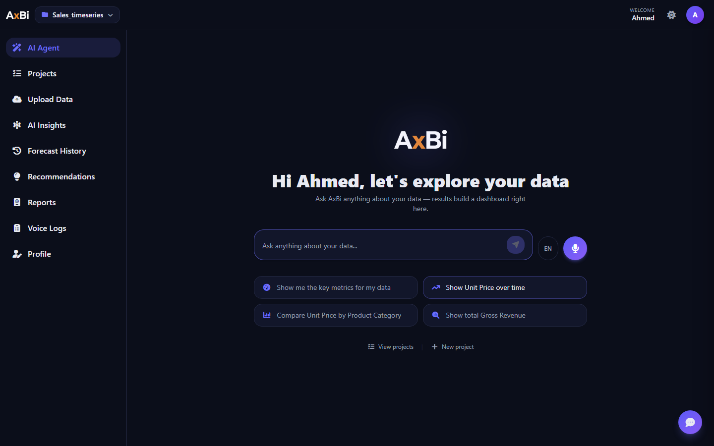

---

## Table of contents

1. [Deploy the project (Docker)](#1-deploy-the-project-docker)
2. [Smoke test after deploy](#2-smoke-test-after-deploy)
3. [Screenshots](#3-screenshots)
4. [What AxBi does](#4-what-axbi-does)
5. [Architecture overview](#5-architecture-overview)
6. [The 8-step processing pipeline](#6-the-8-step-processing-pipeline)
7. [Application features](#7-application-features)
8. [AI Agent & voice](#8-ai-agent--voice)
9. [Forecasting](#9-forecasting)
10. [Segmentation & recommendations](#10-segmentation--recommendations)
11. [Reports & PDF export](#11-reports--pdf-export)
12. [Authentication & data storage](#12-authentication--data-storage)
13. [Supabase database schema](#13-supabase-database-schema)
14. [Project structure](#14-project-structure)
15. [Local development (without Docker)](#15-local-development-without-docker)
16. [Environment variables](#16-environment-variables)
17. [Running tests](#17-running-tests)
18. [Troubleshooting](#18-troubleshooting)
19. [Further documentation](#19-further-documentation)

---

## 1. Deploy the project (Docker)

This is the **recommended** way to run the full stack. You only need **Docker** with **Compose v2** on the host — Linux, macOS, or Windows — no local Python, Node, or Redis install required.

### Architecture (Docker stack)

<p align="center">
  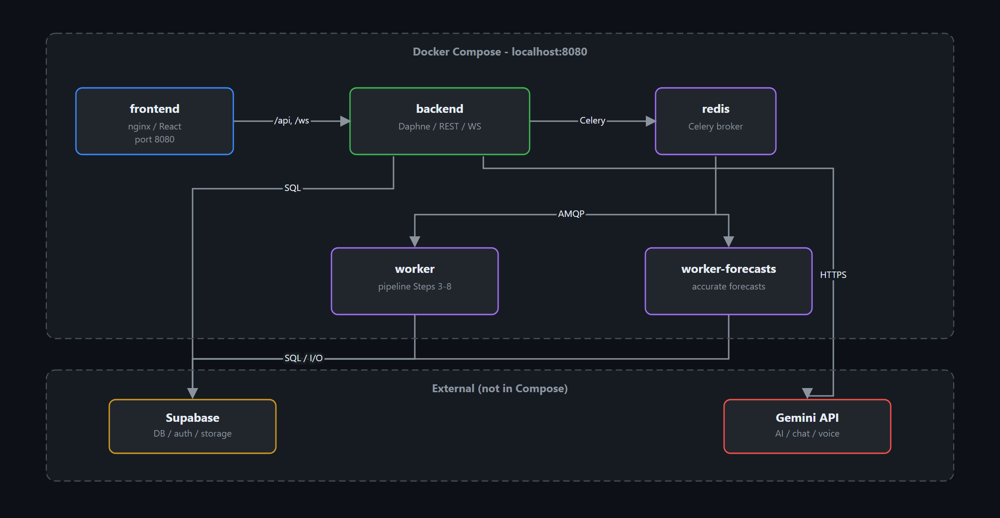
</p>

The diagram shows the **five Compose services** running locally plus external Supabase and Gemini. See the [full modular interface map](#5-architecture-overview) for component-level detail inside each container.

| Compose service | Maps to | Role |
|-----------------|---------|------|
| `frontend` | React SPA + Audio Worklet | nginx serves the SPA on **port 8080**; browser captures voice via PCM worklet |
| `backend` | Daphne → Django REST + Channels | REST API, auth middleware, WebSocket voice proxy |
| `redis` | Redis Broker | Celery task queue and result backend |
| `worker` | Celery Worker 1 | Upload pipeline (Steps 3–8) |
| `worker-forecasts` | Celery Worker 2 | Accurate-mode forecast tournament (`forecasts` queue) |
| *(external)* | Supabase Cloud | PostgreSQL, Auth JWT, `raw_data` / `cleaned_data` storage |
| *(external)* | Gemini API | AI pipeline, chat, reports, Gemini Live voice |

### Prerequisites

- **Docker** with **Compose v2** — [Docker Engine on Linux](https://docs.docker.com/engine/install/), or [Docker Desktop](https://www.docker.com/products/docker-desktop/) on macOS/Windows (both include Compose)
- A free **[Supabase](https://supabase.com)** project (database + auth + file storage)
- A **[Google Gemini API key](https://aistudio.google.com/apikey)** (AI pipeline, chat, voice, reports)

### Step 1 — Supabase setup

1. Create a project at [supabase.com](https://supabase.com).
2. Run all SQL migrations in [`backend/supabase/migrations/`](backend/supabase/migrations/) **in filename order** (SQL Editor).
3. Create two **Storage buckets**: `raw_data` and `cleaned_data`.
4. From **Project Settings → API**, collect:
   - **Project URL** → `SUPABASE_URL` / `VITE_SUPABASE_URL`
   - **service_role key** → `SUPABASE_SERVICE_KEY` *(secret — server only)*
   - **anon key** → `VITE_SUPABASE_ANON_KEY` *(public — baked into frontend)*
   - **JWT secret** → `SUPABASE_JWT_SECRET` *(optional, speeds up auth)*

> Free Supabase projects pause after ~7 days of inactivity. If auth or DB calls fail, open the Supabase dashboard and restore the project.

### Step 2 — Configure environment

```bash
cp .env.example .env
```

Edit `.env` and fill in your keys (see [Environment variables](#16-environment-variables)).

**Never commit real secrets.** `.env` is gitignored.

### Step 3 — Build and run

```bash
docker compose up --build
```

First build may take several minutes (ML dependencies). When healthy:

- **App:** [http://localhost:8080](http://localhost:8080)
- Backend health: `GET /api/health/`

Stop with `Ctrl+C`. Tear down with `docker compose down` (add `-v` to drop the Redis volume).

### Development vs production-style Docker

| Command | Behavior |
|---------|----------|
| `docker compose up` | Merges `docker-compose.override.yml` — **live reload** for backend + Vite HMR |
| `docker compose -f docker-compose.yml up --build` | Production-style — baked images, Daphne, no bind mounts |

See [`DEPLOY.md`](DEPLOY.md) for inline-compose config, maintenance notes, and extended troubleshooting.

---

## 2. Smoke test after deploy

1. Open [http://localhost:8080](http://localhost:8080) and **register / log in**.
2. **Upload** a sample CSV from [`docs/sample-datasets/`](docs/sample-datasets/) (e.g. `sales_timeseries.csv`).
3. Watch the progress bar reach **100%** — the dashboard auto-renders.
4. Open **Report** and export PDF.
5. Run a **fast** forecast on **AI Insights**.
6. Try the **AI Agent** voice mic (tap **عربي** before speaking Arabic).

---

## 3. Screenshots

### AI Agent (voice canvas)

| AI Agent — voice-driven exploration |
|-------------------------------------|
|  |

### Login & projects

| Login | Projects library |
|-------|------------------|
| 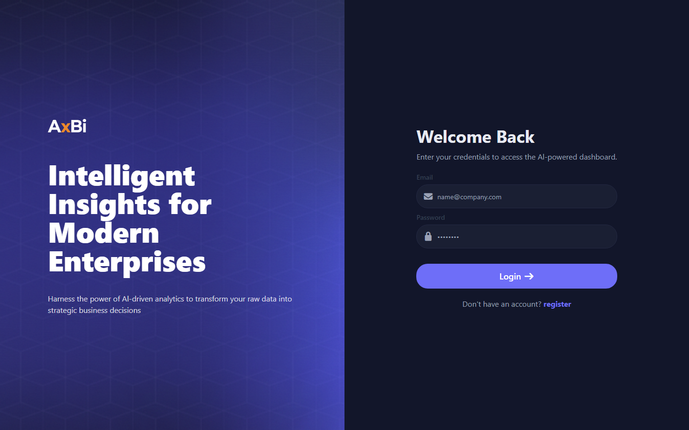 | 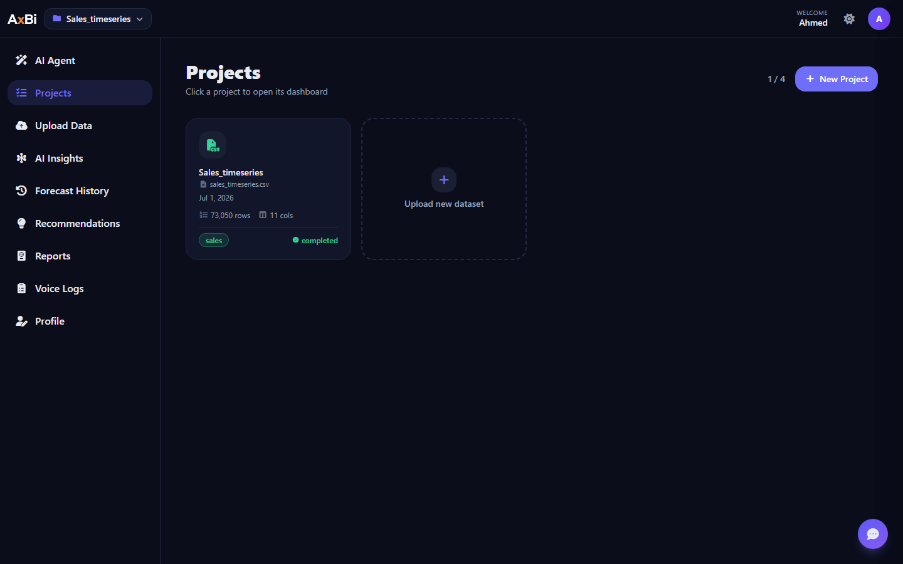 |

### Dashboard

| Interactive dashboard |
|-----------------------|
|  |

### Analytics & insights

| AI Insights (forecasting) | Forecast history | Recommendations |
|---------------------------|------------------|-----------------|
| 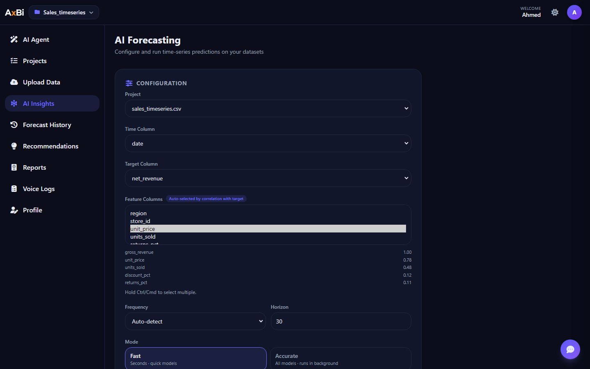 | 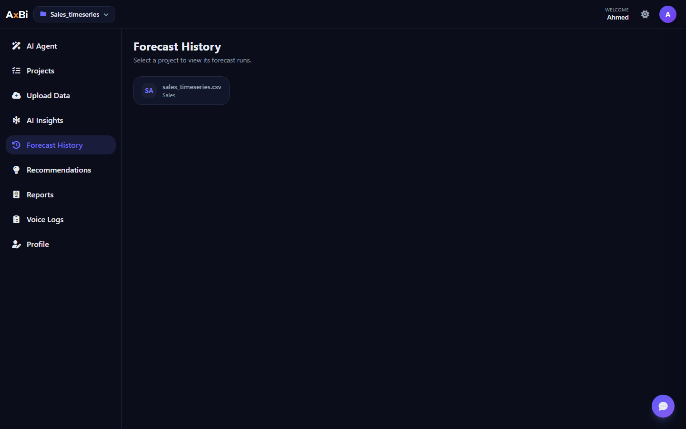 | 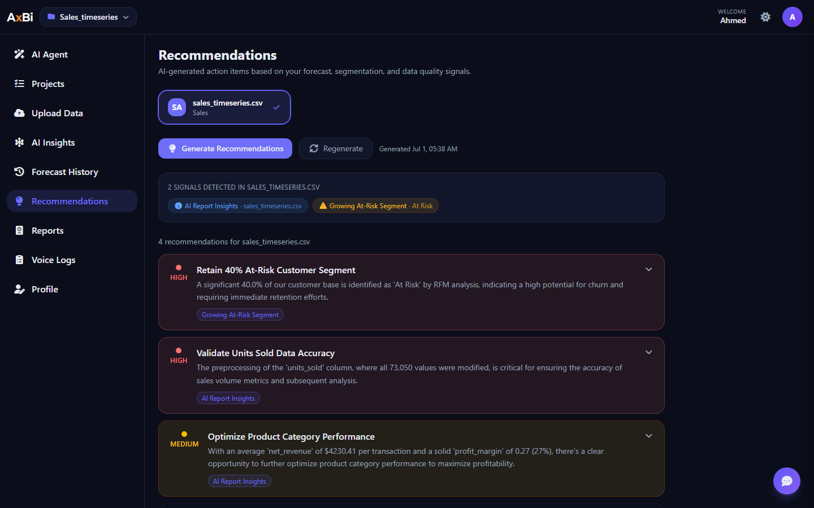 |

### Report, voice & profile

| AI report | Voice logs | Profile |
|-----------|------------|---------|
| 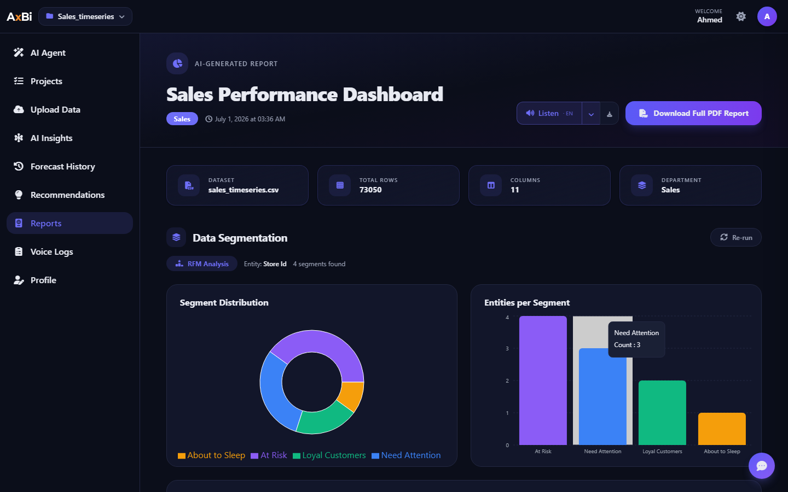 | 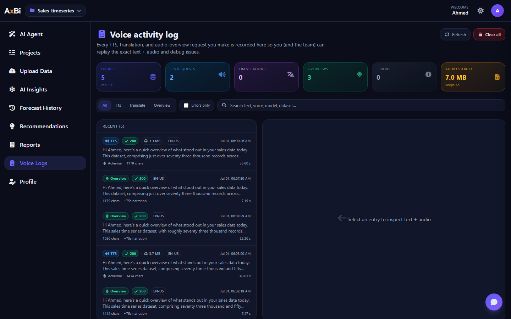 | 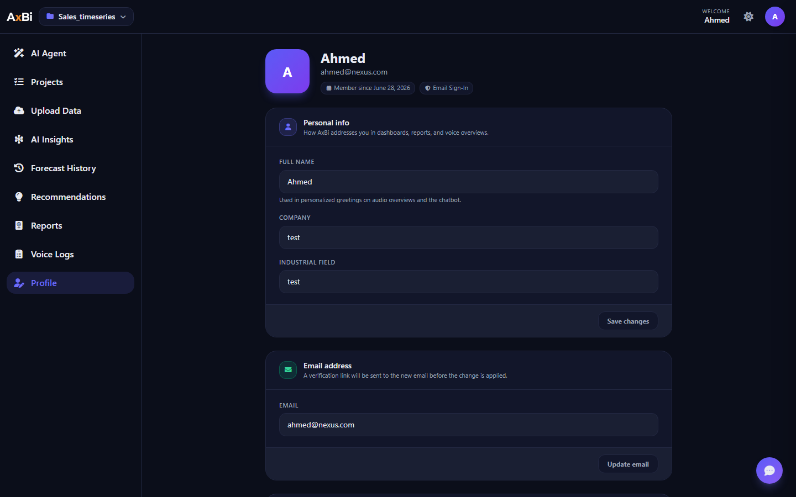 |

---

## 4. What AxBi does

| You provide | AxBi delivers |
|-------------|---------------|
| CSV / XLSX (≤ 50 MB, up to 4 datasets per user) | Cleaned Parquet artifact in cloud storage |
| — | Column profiling + AI semantic labels (metric, dimension, date, …) |
| — | Auto-generated interactive dashboard (Recharts) |
| — | AI narrative business report (Executive Summary, Insights, Recommendations) |
| — | On-demand forecasting with model competition |
| — | RFM / ABC / K-Means segmentation (API) |
| — | Voice + text AI agent scoped to your data and platform |

Supported business domains out of the box: **Sales, Marketing, Operations, HR** — detected automatically from column semantics.

---

## 5. Architecture overview

### Modular system interface map

<p align="center">
  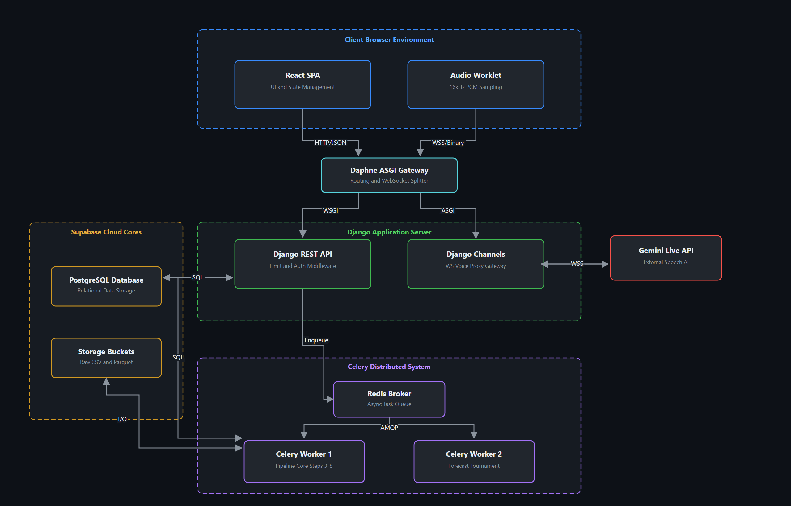
</p>

| Zone | Components | Protocols |
|------|------------|-----------|
| **Client Browser Environment** | React SPA, Audio Worklet (16 kHz PCM) | HTTP/JSON to REST; WSS/binary to voice gateway |
| **Daphne ASGI Gateway** | Request routing, WebSocket splitter | WSGI → REST; ASGI → Channels |
| **Django Application Server** | Django REST API (auth, rate limits), Django Channels (voice proxy) | SQL ↔ Supabase; WSS ↔ Gemini Live |
| **Supabase Cloud Cores** | PostgreSQL, Storage buckets (`raw_data`, `cleaned_data`) | SQL + object I/O from API and workers |
| **Celery Distributed System** | Redis broker, pipeline worker, forecast worker | Enqueue from API; AMQP to workers |
| **Gemini Live API** | External speech AI for real-time voice agent | Bidirectional WSS via Channels proxy |

### Request lifecycle (upload → dashboard)

```
User uploads file
    → POST /api/file-upload/
    → Auth via Supabase JWT
    → File stored in Supabase raw_data bucket
    → datasets + tracking_jobs rows created
    → Celery task queued → HTTP 202 returned immediately

Frontend polls GET /api/check/{job_id}/
    → Progress 0–100% until status = completed
    → Returns columns metadata + suggested_charts

Frontend renders DashboardTemplate with Recharts charts
```

### Tech stack

| Layer | Technology |
|-------|------------|
| Frontend | React 19, TypeScript, Vite, Tailwind, Recharts |
| Backend | Django, Django REST Framework, Channels (WebSocket) |
| Async jobs | Celery + Redis |
| Database & auth | Supabase (PostgreSQL + Auth + Storage) |
| AI | Google Gemini (2.5 Flash / Pro chain with fallbacks) |
| Forecasting | statsmodels, Prophet, LightGBM, CatBoost, ETS, … |
| PDF | WeasyPrint (+ xhtml2pdf fallback) |
| Voice | Gemini Live API (proxied via Django WebSocket) |

---

## 6. The 8-step processing pipeline

Each upload runs **sequentially** inside the `process_dataset_pipeline` Celery task:

| Step | Module | What it does |
|------|--------|--------------|
| 3 | `preprocessing/pipeline.py` | Download raw file → clean (snake_case, nulls, types) → save Parquet to `cleaned_data` |
| 4 | `step4_column_detection.py` | Profile columns: type, stats, null ratio, samples |
| 5 | `step5_ai_semantic.py` | Gemini labels: semantic meaning, role, confidence |
| 6 | `step6_smart_preprocessing.py` | Role-based transforms (normalize metrics, group rare categoricals) |
| 7 | `step7_dashboard_blueprint.py` | Generate `suggested_charts` + dashboard title |
| 8 | `step8_ai_report.py` | Narrative report → stored in `global_context.step8` |

Progress is tracked in `tracking_jobs`. Results live in `datasets.global_context` (JSON, merged per step).

---

## 7. Application features

| Route | Feature |
|-------|---------|
| `/BI-Dashboard` | Project library — list, open, delete datasets |
| `/upload` | File upload wizard + live pipeline progress |
| `/agent` | AI Agent — voice/text canvas dashboard (charts, KPIs, notes) |
| `/AI-Insights` | Forecasting UI — model competition, test chart, history |
| `/forecast-history` | All past forecasts across datasets |
| `/recommendations` | AI-derived action cards from report + segmentation signals |
| `/report` | Step 8 narrative report + PDF export |
| `/conversation/:id` | Text chat with tool calling (charts, navigation, forecasts) |
| `/voice-logs` | Audit trail for TTS, translation, and audio overviews |
| `/profile` | User profile settings |

Protected routes require Supabase login. Public share links: `/share/:token`.

---

## 8. AI Agent & voice

The **AI Agent** page combines:

- **Typed prompts** — streamed Gemini chat with function calling (same tool catalog as Conversation).
- **Live voice** — Gemini Live API via secure WebSocket proxy (`/ws/live/`). The API key never reaches the browser.

Voice behavior:

- Toggle **EN** / **عربي** before speaking — language mode affects transcription and spoken replies.
- Tool results (charts, KPI cards, 3D) appear as draggable widgets on the agent canvas.
- The agent is **scoped to AxBi and your business data** — off-topic questions (sports, trivia, etc.) are politely refused.

**Listen Overview** (dashboard / report): generates a Gemini narration + HD TTS; replays from cache without re-calling APIs.

---

## 9. Forecasting

`POST /api/datasets/{id}/forecast/` runs a **model tournament** on the time series:

- **Always available:** Naive, Seasonal Naive, ETS (Holt-Winters)
- **Optional (graceful degradation):** Prophet, CatBoost, LightGBM, SARIMAX, Theta, Croston

| Mode | Behavior |
|------|----------|
| **Fast** | Skips slowest models; runs **synchronously** in the request |
| **Accurate** | Full tournament on dedicated Celery queue; poll `GET /api/forecasts/status/{job_id}/` |

Requires a second worker: `celery -A core worker -Q forecasts`. In Docker this is the `worker-forecasts` service.

See [`docs/reports-and-analysis/forecasting_report.html`](docs/reports-and-analysis/forecasting_report.html) for the full technical report.

---

## 10. Segmentation & recommendations

**Segmentation** (`POST /api/datasets/{id}/segmentation/`) auto-selects strategy:

1. **RFM** — entity + date + monetary columns
2. **ABC / Pareto** — dimension + value column
3. **K-Means** — fallback for ≥ 2 numeric columns

Results stored in `global_context.segmentation`.

**Recommendations** page surfaces AI-derived action cards from report insights and segmentation status.

---

## 11. Reports & PDF export

Step 8 produces structured sections (Executive Summary, Key Insights, Recommendations) rendered on the Report page.

`POST /api/datasets/{id}/export-pdf/` builds a print-ready PDF with:

- Full-data chart aggregation (Parquet, not the 2k-row sample)
- KPI overview, narrative sections, segmentation insights
- WeasyPrint rendering (requires Cairo/Pango in the Docker image)

---

## 12. Authentication & data storage

- **Auth:** Supabase email/password. Frontend sends `Authorization: Bearer <JWT>`; backend validates via service key in `api/supabase_client.py`.
- **Files:** Raw uploads → `raw_data` bucket; cleaned Parquet → `cleaned_data` bucket.
- **Key tables:** see [Supabase database schema](#13-supabase-database-schema).
- **Limits:** 50 MB upload, 4 datasets per user, 5000 display rows cap in `dataset_rows` (analytics read Parquet for full data).

**Storage buckets:** `raw_data` (uploads), `cleaned_data` (Parquet artifacts).

---

## 13. Supabase database schema

Apply migrations in [`backend/supabase/migrations/`](backend/supabase/migrations/) first. Core tables:

### Table `profiles`

| Name | Type | Constraints |
|------|------|-------------|
| `id` | `uuid` | Primary |
| `name` | `text` |  |
| `company_name` | `text` |  |
| `industrial_field` | `text` |  |
| `email` | `text` | Unique |
| `created_at` | `timestamptz` | Nullable |

### Table `datasets`

| Name | Type | Constraints |
|------|------|-------------|
| `id` | `uuid` | Primary |
| `created_at` | `timestamptz` |  |
| `user_id` | `uuid` |  |
| `file_name` | `text` |  |
| `category_hint` | `text` |  |
| `storage_path` | `text` |  |
| `global_context` | `jsonb` | Nullable |
| `status` | `text` |  |
| `file_info` | `jsonb` | Nullable |
| `processed_path` | `text` | Nullable |
| `project_name` | `text` | Nullable |

`global_context` keys include `step3`, `step4`, `step7`, `step8`, and `segmentation`.

### Table `columns_metadata`

| Name | Type | Constraints |
|------|------|-------------|
| `id` | `uuid` | Primary |
| `created_at` | `timestamptz` |  |
| `dataset_id` | `uuid` |  |
| `original_name` | `text` |  |
| `clean_name` | `text` |  |
| `data_type` | `text` | Nullable |
| `is_primary_metric` | `bool` | Nullable |
| `technical_stats` | `jsonb` | Nullable |
| `ai_profile` | `jsonb` | Nullable |

### Table `tracking_jobs`

| Name | Type | Constraints |
|------|------|-------------|
| `id` | `uuid` | Primary |
| `created_at` | `timestamptz` |  |
| `dataset_id` | `uuid` |  |
| `status` | `text` |  |
| `current_step` | `int8` |  |
| `progress_message` | `text` |  |
| `error_log` | `text` | Nullable |
| `user_id` | `uuid` |  |

### Table `dataset_rows`

| Name | Type | Constraints |
|------|------|-------------|
| `id` | `uuid` | Primary |
| `dataset_id` | `uuid` | Nullable |
| `row_data` | `jsonb` |  |
| `row_index` | `int4` |  |

Display sample only (capped at 5k rows). Full analytics read the Parquet file in storage.

### Table `forecast_logs`

| Name | Type | Constraints |
|------|------|-------------|
| `id` | `int8` | Primary |
| `dataset_id` | `uuid` |  |
| `user_id` | `uuid` |  |
| `created_at` | `timestamptz` |  |
| `time_column` | `text` |  |
| `target_column` | `text` |  |
| `feature_columns` | `jsonb` |  |
| `frequency_hint` | `text` | Nullable |
| `frequency_used` | `text` | Nullable |
| `horizon` | `int4` |  |
| `missing_policy` | `text` |  |
| `input_rows` | `int4` |  |
| `prepared_rows` | `int4` | Nullable |
| `season_length` | `int4` | Nullable |
| `log_transformed` | `bool` |  |
| `non_negative` | `bool` |  |
| `candidate_models` | `jsonb` |  |
| `eligible_models` | `jsonb` |  |
| `skipped_models` | `jsonb` |  |
| `forecast_possible` | `bool` |  |
| `model_results` | `jsonb` |  |
| `best_model` | `text` | Nullable |
| `best_mae` | `float8` | Nullable |
| `best_rmse` | `float8` | Nullable |
| `best_wape` | `float8` | Nullable |
| `forecast_points` | `int4` |  |
| `duration_ms` | `int4` | Nullable |
| `error_message` | `text` | Nullable |
| `readiness_reasons` | `jsonb` |  |
| `forecast_data` | `jsonb` | Nullable |

### Table `conversations`

| Name | Type | Constraints |
|------|------|-------------|
| `id` | `uuid` | Primary |
| `user_id` | `uuid` |  |
| `title` | `text` | Nullable |
| `share_token` | `uuid` | Nullable |
| `created_at` | `timestamptz` | Nullable |

### Table `conversation_messages`

| Name | Type | Constraints |
|------|------|-------------|
| `id` | `uuid` | Primary |
| `conversation_id` | `uuid` |  |
| `role` | `text` |  |
| `content` | `text` |  |
| `chart_data` | `jsonb` | Nullable |
| `visual_3d` | `jsonb` | Nullable |
| `created_at` | `timestamptz` | Nullable |

---

## 14. Project structure

```
BI-Dashboard/
├── frontend/          # React + Vite SPA
│   └── src/
│       ├── Components/   # UI pages (Agent, Dashboard, Report, …)
│       ├── hooks/        # useAgentBoard, useChat, useTheme
│       └── lib/          # liveClient, chartTheme, brandLogos
├── backend/           # Django API + Celery tasks
│   ├── api/              # views, chat, live_consumer, forecasting, segmentation
│   ├── preprocessing/    # Step 3 cleaning pipeline
│   ├── core/             # settings, Celery, ASGI
│   └── supabase/migrations/
├── docs/              # Sample datasets, architecture PDFs, reports
├── docker-compose.yml
├── docker-compose.override.yml
├── .env.example
└── DEPLOY.md          # Extended deployment guide
```

---

## 15. Local development (without Docker)

Useful when editing frontend/backend natively with hot reload.

### Backend

```bash
cd backend
python -m venv .venv
# Windows: .venv\Scripts\activate
pip install -r requirements.txt
# Create backend/.env (see .env.example)
python manage.py runserver          # http://127.0.0.1:8000
celery -A core worker --loglevel=info --pool=solo   # Windows requires --pool=solo
celery -A core worker --loglevel=info --pool=solo -Q forecasts   # 2nd terminal
```

Redis must be running locally (`docker run -d -p 6379:6379 redis:7`).

### Frontend

```bash
cd frontend
npm install
# Create frontend/.env with VITE_SUPABASE_* and VITE_API_BASE_URL_LOCAL=http://127.0.0.1:8000/api
npm run dev    # http://localhost:5173
```

See [`docs/architecture-and-system-design/QUICKSTART.md`](docs/architecture-and-system-design/QUICKSTART.md) for a Windows-focused walkthrough.

---

## 16. Environment variables

| Variable | Where | Purpose |
|----------|-------|---------|
| `DJANGO_SECRET_KEY` | Backend | Django signing |
| `SUPABASE_URL` | Backend | Supabase project URL |
| `SUPABASE_SERVICE_KEY` | Backend | Server-side DB/storage access *(secret)* |
| `SUPABASE_JWT_SECRET` | Backend | Optional fast JWT verify |
| `GEMINI_API_KEY` | Backend | All Gemini features |
| `VITE_SUPABASE_URL` | Frontend build | Supabase URL in SPA |
| `VITE_SUPABASE_ANON_KEY` | Frontend build | Public anon key |
| `GOOGLE_TTS_API_KEY` | Backend | Optional Chirp 3 HD TTS |
| `CELERY_BROKER_URL` | Backend | Set automatically in Docker |

Full template: [`.env.example`](.env.example).

When adding a new env var to the code, also update `.env.example` and the `x-app-config` block in `docker-compose.yml`.

---

## 17. Running tests

```bash
cd backend
pytest tests/                              # all tests
pytest tests/test_forecasting_service.py -v   # single file
```

---

## 18. Troubleshooting

| Symptom | Likely fix |
|---------|------------|
| Pipeline stuck at 0% | Check `worker` container logs; ensure Redis is healthy |
| Accurate forecast never finishes | Check `worker-forecasts` logs |
| 401 on API calls | Verify Supabase keys; un-pause Supabase project |
| Voice mic connects but no reply | Restart backend; check logs for Live API setup errors |
| Upload rejected | Max 50 MB; max 4 datasets per user |
| Missing Python module in Docker | Add to `backend/requirements.docker.txt`, rebuild |

More detail: [`DEPLOY.md`](DEPLOY.md).

---

## 19. Further documentation

| Document | Contents |
|----------|----------|
| [`DEPLOY.md`](DEPLOY.md) | Full Docker deploy, secrets, troubleshooting |
| [`docs/reports-and-analysis/forecasting_report.html`](docs/reports-and-analysis/forecasting_report.html) | Forecasting deep dive |
| [`docs/sample-datasets/`](docs/sample-datasets/) | Sales, Marketing, Operations, HR sample CSVs |

---

## Team

**AxBi** — FCIS, Ain Shams University, Information Systems Department (Graduation Project).

**Contributors:**

- Ahmed Mostafa
- Kamal Elden Sayed
- Omar Mohamed
- Omar Ahmed
- Mina Tawfek
- Omar Wafik

For questions about deployment, start with [Deploy the project](#1-deploy-the-project-docker) and [`DEPLOY.md`](DEPLOY.md).
