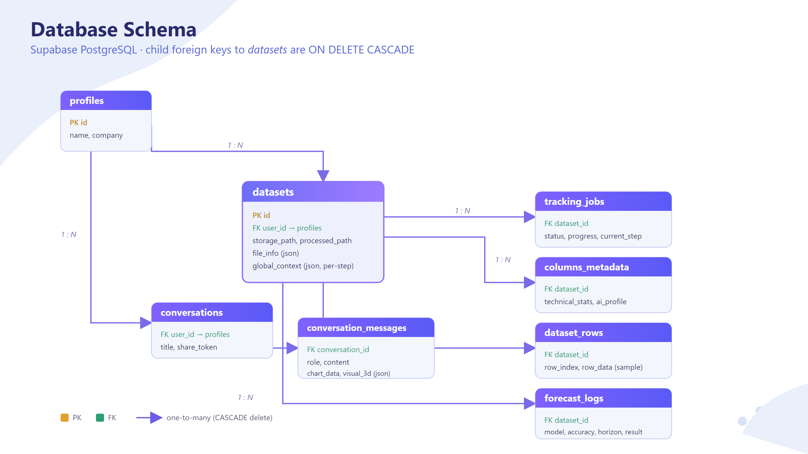

```

```

# AxBi — Backend Architecture & Deep-Dive

> **Living document.** Update it as features evolve. Scope: **backend only** (`api/`, `core/`,
> `preprocessing/`). Frontend is referenced only where a feature spans it.
>
> Three sections:
>
> 1. **Per-file map** — what every backend file is responsible for, in flow order.
> 2. **Feature deep-dives** — end-to-end for each main function (upload, pipeline, forecasting,
>    segmentation, report, recommendations, voice/chat) with large-vs-small handling, problems
>    faced, and optimizations.
> 3. **Concepts** — the tech we lean on (Redis, Celery, Supabase, Gemini chain, Parquet,
>    WebSocket/Channels, json_repair…).

---

## Section 0 — The Big Picture

**AxBi** accepts CSV/XLSX files, runs an 8-step AI pipeline asynchronously, and produces an
interactive dashboard, a narrative report, forecasting, segmentation, recommendations, and a
voice/chat assistant.

### Request lifecycle

```
User uploads file(s) ──► POST /api/file-upload/
    │  auth via Supabase JWT
    │  multi-file MERGE (accumulation) ──► one combined CSV
    │  store raw in Supabase `raw_data` bucket
    │  create `datasets` + `tracking_jobs` rows
    │  queue Celery task ──► return HTTP 202 immediately
    ▼
Celery worker runs the 8-step pipeline (Steps 3→4→5→6→7→8)
    Step 3 clean ─► Parquet in `cleaned_data` bucket
    Step 4 profile columns ─► columns_metadata
    Step 5 AI semantic (Gemini) ─► ai_profile
    Step 6 smart preprocessing
    Step 7 dashboard blueprint (suggested_charts)
    Step 8 AI report (insights + recommendations + sections)
    ▼
Frontend polls GET /api/check/{job_id}/  (progress 0–100%)
    on complete ─► columns metadata + suggested_charts
    ▼
Dashboard renders. Report / Forecast / Segmentation / Chat run on demand.
```

### Layered view

```
            HTTP (REST)                         WebSocket
  ┌───────────────────────────┐        ┌────────────────────────┐
  │ api/views.py (endpoints)  │        │ api/live_consumer.py    │
  │ api/chat.py (assistant)   │        │  (Gemini Live proxy)    │
  └────────────┬──────────────┘        └────────────────────────┘
               │ queue / call
  ┌────────────▼──────────────┐
  │ api/tasks.py (Celery)     │  ◄── Redis broker / result backend
  └────────────┬──────────────┘
               │ calls
  ┌────────────▼───────────────────────────────────────────────┐
  │ preprocessing/  (Step 3)                                    │
  │ api/processing/ (Steps 4–8)                                 │
  │ api/forecasting/  api/segmentation/  api/recommendations/   │
  │ api/accumulation/ (upload merge)                            │
  └────────────┬───────────────────────────────────────────────┘
               │ all DB/storage/auth through
  ┌────────────▼──────────────┐
  │ api/supabase_client.py    │  ◄── Supabase (Postgres + buckets + JWT)
  └───────────────────────────┘     + Parquet artifact for heavy analytics
```

---

## Section 0.5 — System Architecture


> **The whole runtime on one page.** Browser (React SPA + an audio worklet for voice) talks to a
> single **Daphne ASGI gateway**, which splits traffic: plain `HTTP/JSON` → the **Django REST API**,
> `WSS/Binary` (live voice) → **Django Channels**. Heavy work is pushed onto a **Redis**-brokered
> **Celery** cluster (Worker 1 = the 8-step pipeline, Worker 2 = the forecast tournament). All
> durable state lives in **Supabase** (PostgreSQL + Storage buckets); **Gemini Live** is the only
> outbound realtime dependency (its key never leaves the server — see the proxy below).

### Component inventory

| Component                                    | Responsibility                                                      | Where                                                  |
| -------------------------------------------- | ------------------------------------------------------------------- | ------------------------------------------------------ |
| **React SPA (Vite)**                   | UI, state, all HTTP via one client; polls job progress              | `frontend/src/`, `frontend/src/api.js`             |
| **Audio worklet**                      | 16 kHz PCM capture for live voice                                   | frontend voice components                              |
| **ASGI gateway (Daphne)**              | one server for HTTP**and** WebSocket; routes by protocol      | `core/asgi.py`, `core/routing`/`api/routing.py`  |
| **Django REST API**                    | every endpoint, auth middleware, rate limits, sync work             | `api/views.py`, `api/urls.py`                      |
| **Django Channels**                    | live-voice WebSocket proxy to Gemini Live                           | `api/live_consumer.py`                               |
| **Celery worker 1 (default queue)**    | 8-step upload/append pipeline                                       | `api/tasks.py` (`process_dataset_pipeline`)        |
| **Celery worker 2 (`-Q forecasts`)** | accurate-mode forecast tournament                                   | `api/tasks.py` (`run_forecast_task`)               |
| **Redis**                              | Celery**broker** + **result backend** (`AsyncResult`) | `core/celery.py`, `core/settings.py`               |
| **Supabase Postgres**                  | all relational state (8 tables)                                     | via`api/supabase_client.py`                          |
| **Supabase Storage**                   | `raw_data` (uploads) + `cleaned_data` (Parquet) buckets         | via`api/supabase_client.py`                          |
| **Supabase Auth (JWT)**                | identity; token verified server-side                                | `verify_supabase_token` — `supabase_client.py:25` |
| **Google Gemini**                      | Steps 5/7/8, segmentation, chat, TTS,**Live** voice           | per-module clients +`live_consumer.py`               |

### Two runtimes, one codebase

The same Django project is served two ways:

- **WSGI** (`core/wsgi.py`) — classic synchronous HTTP. Fine for the REST API alone.
- **ASGI** (`core/asgi.py`) — async server (Daphne) that carries **both** HTTP **and** the
  `ws/live/` WebSocket. Live voice is bidirectional and long-lived, so it *requires* ASGI +
  Channels; a WSGI-only deploy loses voice but keeps every REST feature.

### Synchronous vs. asynchronous — who does the work

| Runs**inline** in the request         | Runs**async** on Celery                                       |
| ------------------------------------------- | ------------------------------------------------------------------- |
| Upload validation + accumulation merge      | The 8-step pipeline (`process_dataset_pipeline`)                  |
| **Fast** forecast (`mode:"fast"`)   | **Accurate** forecast (`mode:"accurate"`, `-Q forecasts`) |
| Segmentation, chart customize, correlations | (chart cache is built*inside* the pipeline worker)                |
| Chat / TTS / audio-overview                 | —                                                                  |

The async contract is **202 + poll**: `file_upload` returns `202 {job_id}` immediately, the
frontend polls `check_job_status` (`views.py:603`) for 0–100 %. Accurate forecasts use the same
shape via `get_forecast_status_view`. The dedicated `forecasts` queue means a slow tournament never
blocks an upload. **Windows caveat:** workers run `--pool=solo`, which can't enforce Celery
`time_limit` (no child to kill) — the frontend poll ceiling is the real guard.

### End-to-end data flow

```
upload ─► Supabase raw_data bucket ─► Step 3 clean ─► cleaned_data bucket (Parquet)
                                                          │
                       ┌──────────────────────────────────┘
                       ▼
   Step 4 profile ─► columns_metadata      (per-column stats)
   Step 5 semantic ─► columns_metadata      (ai_profile: role/meaning/confidence)
   Step 6 smart transform ─► smart Parquet  (cleaned_data bucket)
   Step 7 blueprint ─► datasets.global_context.step7  (suggested_charts)
   Step 8 report ─► datasets.global_context.step8      (+ dataset_rows display sample ≤5000)

Read paths:
   heavy analytics (forecast / segmentation / customize) ─► read the Parquet artifact
   dashboard table / PDF export                          ─► read dataset_rows (≤2000)
```

The rule: **the Parquet artifact is the source of truth for analytics; `dataset_rows` is only a
bounded display sample** (true row count lives in `datasets.file_info.row_count`).

### Security layers

- **JWT at the edge** — every REST call carries a Supabase `Authorization: Bearer` token; the
  backend verifies it with the service key before any work (`verify_supabase_token`).
- **Service key + RLS** — the backend uses the Supabase **service role** (bypasses RLS); RLS
  policies on user tables are defense-in-depth for any direct client access.
- **Live-voice proxy** — the browser never sees the Gemini key; `LiveProxyConsumer`
  (`live_consumer.py:182`) relays audio both ways so the secret stays server-side.
- **Guards** — CORS locked to `:5173`, 50 MB upload cap (frontend + Django + storage), 4-dataset
  limit per user, per-user rate limits on forecast (30 s) and TTS.

### Deployment

Shipped as **Docker Compose** (repo is public → secrets via `.env`, never committed). The running
process set: Django (ASGI/Daphne), **two** Celery workers (default + `forecasts`), Redis, and the
built frontend. See `DEPLOY.md` / `README.md §5` for the compose file and env matrix.

### Why these pieces (rationale)

| Choice                           | Why                                                                                                                                    |
| -------------------------------- | -------------------------------------------------------------------------------------------------------------------------------------- |
| **Celery + Redis**         | AI steps take seconds–minutes; a web request must not block that long → offload + poll                                               |
| **Supabase**               | one managed dependency for Postgres**+** Auth (JWT)**+** Storage, free tier for a student project                                |
| **Parquet artifacts**      | columnar + ~4× smaller than CSV; analytics read columns fast, and a 600k-row CSV would exceed the Storage per-object limit (HTTP 413) |
| **Gemini model chain**     | resilience — if`flash` is rate-limited, fall through to `pro` → `2.0-flash`                                                    |
| **Django Channels / ASGI** | live voice needs a bidirectional, long-lived socket WSGI can't provide                                                                 |

---

## Section 0.6 — Database Schema



> Supabase **PostgreSQL**. `datasets` is the hub; **every** child FK to `datasets(id)` is
> `ON DELETE CASCADE`. The subsections below are the authoritative, column-level version of the
> picture.

### Source of truth — read this first

**The `backend/supabase/migrations/` folder is NOT authoritative.** It contains historical and
never-applied files. Trust the **live DB table list** (verified via the PostgREST root) + the
`20260205..._actual_current_schema.sql` snapshot:

- `20260123..._create_initial_schema.sql` defines a **superseded** design (`data_sources`,
  `business_data`, `kpi_targets`, `derived_metrics`, `column_mappings`, `standardized_fields`, a
  wide `profiles`). **None of these tables exist live** — do not document them.
- `20260408..._create_forecast_results.sql` was **never applied** — there is **no** `forecast_results`
  table. All forecast code uses `forecast_logs`.
- `conversations` / `conversation_messages` have **no migration file** — they were created
  out-of-band in Supabase (columns confirmed from `api/conversations.py` + CLAUDE.md).

**Live DB = 8 tables:** `profiles`, `datasets`, `tracking_jobs`, `columns_metadata`,
`dataset_rows`, `forecast_logs`, `conversations`, `conversation_messages`.

### ER overview

```
auth.users
   │ 1:1 (trigger on signup)
   ▼
profiles ──1:N──► datasets ──1:N──► columns_metadata   (CASCADE)
   │                  ├───1:N──────► tracking_jobs      (CASCADE)
   │                  ├───1:N──────► dataset_rows        (CASCADE)
   │                  └───1:N──────► forecast_logs       (CASCADE)
   └───1:N──► conversations ──1:N──► conversation_messages (CASCADE)
```

### `profiles` — one row per auth user

Extends `auth.users`. Auto-created on signup by the `handle_new_user()` trigger
(`20260211..._create_auto_profile_trigger.sql:26`), which reads `raw_user_meta_data`.

| Column               | Type        | Notes                                         |
| -------------------- | ----------- | --------------------------------------------- |
| `id`               | uuid PK     | FK →`auth.users(id)` `ON DELETE CASCADE` |
| `name`             | text        | from signup metadata                          |
| `company_name`     | text        |                                               |
| `industrial_field` | text        |                                               |
| `email`            | text        |                                               |
| `created_at`       | timestamptz | `default now()`                             |

All other user-owned tables FK to `profiles(id)`.

### `datasets` — the hub (one row per upload)

| Column             | Type        | Notes                                                             |
| ------------------ | ----------- | ----------------------------------------------------------------- |
| `id`             | uuid PK     | `gen_random_uuid()`                                             |
| `created_at`     | timestamptz |                                                                   |
| `user_id`        | uuid        | FK →`profiles(id)`                                             |
| `file_name`      | text        | original upload name                                              |
| `category_hint`  | text        | user-chosen department (Sales/HR/…); may be overridden by Step 8 |
| `storage_path`   | text        | path in the`raw_data` bucket                                    |
| `global_context` | jsonb       | per-step result blob (layout below)                               |
| `status`         | text        | pipeline lifecycle state                                          |
| `project_name`   | text        | user-facing name (added`20260629`)                              |

### `columns_metadata` — one row per column

Step 4 writes the technical stats; Step 5 writes the AI fields (`column_role`,
`semantic_meaning`, `column_confidence`, `is_primary_metric`).

| Column                | Type             | Notes                                                            |
| --------------------- | ---------------- | ---------------------------------------------------------------- |
| `id`                | uuid PK          |                                                                  |
| `created_at`        | timestamptz      |                                                                  |
| `dataset_id`        | uuid             | FK →`datasets(id)` **CASCADE** (`20260628`)           |
| `original_name`     | text             | raw header                                                       |
| `clean_name`        | text             | snake_case                                                       |
| `data_type`         | text             | numeric/categorical/datetime/…                                  |
| `column_role`       | text             | id/measure/dimension/date/geographic/descriptive/boolean/unknown |
| `semantic_meaning`  | text             | human-friendly name (Gemini)                                     |
| `column_confidence` | double precision | 0–1                                                             |
| `is_primary_metric` | boolean          | KPI highlight flag                                               |

Indexed on `dataset_id` (`idx_columns_metadata_dataset`).

### `tracking_jobs` — async progress

| Column               | Type        | Notes                                   |
| -------------------- | ----------- | --------------------------------------- |
| `id`               | uuid PK     |                                         |
| `created_at`       | timestamptz |                                         |
| `dataset_id`       | uuid        | FK →`datasets(id)` **CASCADE** |
| `status`           | text        | queued/running/completed/failed         |
| `current_step`     | text        | drives the progress %                   |
| `progress_message` | text        |                                         |
| `error_log`        | text        | failure reason surfaced to the user     |

### `dataset_rows` — bounded display sample

Not the full dataset — a capped sample for the display table + PDF only. True count is in
`datasets.file_info.row_count`.

| Column         | Type         | Notes                                               |
| -------------- | ------------ | --------------------------------------------------- |
| `id`         | bigserial PK |                                                     |
| `dataset_id` | uuid         | FK →`datasets(id)` **CASCADE**             |
| `row_index`  | integer      | `CHECK (>= 0)`; `UNIQUE(dataset_id, row_index)` |
| `row_data`   | jsonb        | one cleaned row                                     |
| `created_at` | timestamptz  |                                                     |

Indexes: `idx_dataset_rows_dataset_row (dataset_id, row_index)` — **required** for the batched
delete path; GIN on `row_data`. Cap = `DATASET_ROWS_DISPLAY_CAP = 5000` (`tasks.py`). RLS on
(owner-only via a `datasets` ownership subquery).

### `forecast_logs` — one row per forecast run

| Group           | Columns                                                                                                                                          |
| --------------- | ------------------------------------------------------------------------------------------------------------------------------------------------ |
| Keys            | `id` bigserial, `dataset_id` (CASCADE), `user_id` → profiles, `created_at`                                                              |
| Request         | `time_column`, `target_column`, `feature_columns` jsonb, `frequency_hint`, `frequency_used`, `horizon`, `missing_policy`           |
| Data chars      | `input_rows`, `prepared_rows`, `season_length`, `log_transformed`, `non_negative`                                                      |
| Model selection | `candidate_models`, `eligible_models`, `skipped_models` (all jsonb)                                                                        |
| Results         | `forecast_possible`, `model_results` jsonb, `best_model`, `best_mae`, `best_rmse`, `best_wape`, `forecast_points`, `duration_ms` |
| Errors          | `error_message`, `readiness_reasons` jsonb                                                                                                   |

Indexes: `(dataset_id, created_at DESC)`, `(user_id, created_at DESC)`, `(best_model)`. RLS +
a service-role full-access policy (backend inserts with the service key).

### `conversations` — chat sessions

No migration file; created out-of-band. **Not linked to `datasets`** (no `dataset_id`).

| Column          | Type        | Notes                 |
| --------------- | ----------- | --------------------- |
| `id`          | uuid PK     |                       |
| `user_id`     | uuid        | FK →`profiles(id)` |
| `title`       | text        |                       |
| `share_token` | uuid        | public SharePage link |
| `created_at`  | timestamptz |                       |

### `conversation_messages` — one row per chat message

| Column              | Type        | Notes                                        |
| ------------------- | ----------- | -------------------------------------------- |
| `id`              | uuid PK     |                                              |
| `conversation_id` | uuid        | FK →`conversations(id)` **CASCADE** |
| `role`            | text        | user / assistant                             |
| `content`         | text        |                                              |
| `chart_data`      | jsonb       | rendered chart payload, if any               |
| `visual_3d`       | jsonb       | 3D visual payload, if any                    |
| `created_at`      | timestamptz |                                              |

### `datasets.global_context` JSON layout

One jsonb blob; **each writer owns its own key — never overwrite the whole blob, always merge.**

| Key                 | Written by           | Holds                                                          |
| ------------------- | -------------------- | -------------------------------------------------------------- |
| `step3`           | Step 3               | cleaning summary                                               |
| `step4`           | Step 4               | column profiling metadata                                      |
| `step7`           | Step 7               | `{ suggested_charts, suggested_title }`                      |
| `step8`           | Step 8               | `{ sections, report_html, category fields }`                 |
| `segmentation`    | segmentation service | `{ method, segments, insights, charts, scatter_data }`       |
| `chart_cache`     | pipeline worker      | pre-aggregated dashboard charts (see §10)                     |
| `recommendations` | recs service         | `{ snapshot_hash, signals, recommendations }` (see §6/§10) |

### Storage buckets & filesystem (not tables)

- **`raw_data`** — the raw uploaded file (`datasets.storage_path`).
- **`cleaned_data`** — Step 3 Parquet **and** the Step 6 smart Parquet (analytics source of truth).
- **Voice logs** — filesystem JSONL + mp3 under `BASE_DIR/logs/voice/`, not Supabase.

### Delete path (why cascade alone isn't enough)

`dataset_rows` can hold 200k–400k+ rows; a single cascading `DELETE datasets` runs the child delete
inside one statement and hits the Postgres statement timeout (`57014`). `delete_dataset_full`
(`supabase_client.py:449`) therefore **batch-deletes `dataset_rows` first**
(`delete_dataset_rows`, paged by `row_index`, `supabase_client.py:344`), then deletes the parent so
cascade only mops up the small child tables. Full detail in §2.1.

---

## Section 1 — Per-File Map (in flow order)

### Entry / config (`core/`, routing)

- **`core/settings.py`** — Django settings. Celery config (`CELERY_TASK_ROUTES` sends
  `run_forecast_task` to the `forecasts` queue; soft/hard time limits 5/6 min), CORS
  (localhost:5173 only), upload caps (`FILE_UPLOAD_MAX_MEMORY_SIZE`/`DATA_UPLOAD_MAX_MEMORY_SIZE`
  = 50 MB), Channels/ASGI app.
- **`core/celery.py`** — Celery app instance; autodiscovers tasks.
- **`core/urls.py`** — root URL conf; includes `api/urls.py`.
- **`core/asgi.py`** — ASGI entrypoint; wires Django Channels so HTTP **and** WebSocket share one
  server (needed for the live voice proxy).
- **`core/wsgi.py`** — WSGI entrypoint (plain HTTP deployments).
- **`api/urls.py`** — all REST routes → view functions.
- **`api/routing.py`** — WebSocket routes; maps `ws/live/` → `LiveProxyConsumer`.

### HTTP layer

- **`api/views.py`** — every REST endpoint: `health_view`, `file_upload`, `append_to_dataset_view`,
  `check_job_status`, dataset list/delete/dashboard/rows/aggregate, `customize_chart_view`
  (interactive re-aggregation), `column_correlations_view` (mind-map), dataset category
  (`update_dataset_category_view`/`detect_dataset_category_view`/`model_category_stats_view`),
  `forecast_dataset_view` (+ fast/accurate mode + async branch), `get_forecast_status_view`, forecast
  history/detail/accuracy/delete, `get_feature_recommendations_view`, `export_pdf`, segmentation
  run/results, recommendations get/generate, KPI stats, and the TTS/voice REST layer (`tts_view`,
  `tts_usage_view`, `translate_for_tts_view`, `dataset_audio_overview_view`, `voice_logs_*`). Also
  production hardening for forecasting (per-user rate limit → 429, timeout → 504,
  `_persist_forecast_log`). See the **REST Endpoint Map** below for the full route list.
- **`api/supabase_client.py`** — single gateway to Supabase: `verify_supabase_token()` (JWT auth),
  dataset/job/column CRUD, bucket upload/download, and the **batched delete path**
  (`delete_dataset_rows` paged by `row_index`, `delete_dataset_full`).

### Async

- **`api/tasks.py`** — Celery tasks. `process_dataset_pipeline` runs Steps 3→8 sequentially;
  `run_forecast_task` runs accurate-mode forecasts on the `forecasts` queue. Holds
  `DATASET_ROWS_DISPLAY_CAP = 5000` and `_persist_dataset_rows` (display sample only).

### Preprocessing — Step 3 (`preprocessing/`)

- **`preprocessing/pipeline.py`** — Step 3 orchestrator: download raw → clean → write Parquet to
  `cleaned_data`. Handles CSV encoding fallbacks.
- **`preprocessing/cleaning.py`** — the actual cleaning: snake_case columns, null normalization,
  type coercion (`preprocess_dataframe`).
- **`preprocessing/profiling.py`** — lightweight column profiling helpers used during cleaning.
- **`preprocessing/ai_logic.py`** — AI-assisted cleaning heuristics.

### Pipeline — Steps 4–8 (`api/processing/`)

- **`step4_column_detection.py`** — profile each column: detect type, compute stats
  (min/max/mean/top-5/null-ratio) → `columns_metadata`.
- **`step5_ai_semantic.py`** — send column names + stats to Gemini → `semantic_meaning`,
  `role`, `column_confidence`. **Resilient to malformed JSON only**: forces JSON output on the strict
  retry, runs a `json_repair` salvage ladder, and retries once. There is **no rule-based profile
  fallback** — a total Gemini outage raises `All Gemini models failed` and **aborts the pipeline**.
- **`step6_smart_preprocessing.py`** — role-based transforms using Step-5 labels (normalize
  metrics, group rare categoricals, fix datetime formats).
- **`step7_dashboard_blueprint.py`** — generate `suggested_charts` + `suggested_title`. Uses
  `response_mime_type=application/json` + `max_output_tokens=8192` to avoid JSON truncation; has
  a rule-based fallback blueprint when AI JSON is unrecoverable.
- **`step8_ai_report.py`** — narrative report: 3 `sections` + structured `insights` +
  `recommendations` (added this session). Has `_build_fallback_report` for AI failure.

### Upload merge

- **`api/accumulation/service.py`** — pure-pandas helpers to combine multiple same-schema files:
  `normalize_columns`, `schemas_match`, `detect_key`, `combine` (upsert/last-wins or dedup),
  `accumulate_files`. Used by both `file_upload` and `append_to_dataset_view`.

### Forecasting

- **`api/forecasting/service.py`** — `run_forecast_service()`: prepares the series, runs the model
  tournament, backtests, selects best, builds predictions + confidence intervals. Holds the model
  registry (`SUPPORTED_MODELS`), mode gating, point cap, adaptive folds.
- **`api/forecasting/feature_recommender.py`** — suggests which feature columns help a forecast.

### Segmentation

- **`api/segmentation/service.py`** — `run_segmentation_service()`: auto-detects strategy, samples
  large data (50k cap + 120s timeout), calls Gemini for cluster naming + insights (with salvage).
- **`api/segmentation/strategies.py`** — the three algorithms: `rfm_segmentation`, `abc_analysis`,
  `kmeans_segmentation`.

### Recommendation engine

- **`api/recommendations/service.py`** — entry point; orchestrates detectors → context → Gemini.
- **`api/recommendations/signal_detectors.py`** — rule-based detectors that surface signals
  (forecast decline/growth, low-confidence forecast, severe overfit, shrinking/growing segments,
  concentration risk, high-null columns, stale data, forecast error, report insights…).
- **`api/recommendations/context_builder.py`** — assembles dataset context for the prompt.
- **`api/recommendations/gemini_client.py`** — Gemini call wrapper for this module.
- **`api/recommendations/prompts.py`** — prompt templates.
- **`api/recommendations/schemas.py`** — output validation schemas.

### Voice / chat

- **`api/chat.py`** — AI assistant powered by **Gemini function-calling**. Declares **18** tools
  (navigate, list projects, dataset summary, query data, generate chart, 3D visual, detect
  anomalies, compare datasets, quality report, get recommendations, export PDF, forecast
  history/accuracy, run forecast, run segmentation, delete dataset, onboarding). Streams responses
  via SSE.
- **`api/live_consumer.py`** — **Gemini Live API WebSocket proxy** (`LiveProxyConsumer`). Bridges
  browser ↔ Django (Channels) ↔ Gemini Live so the API key never reaches the client; injects a
  dataset-aware Egyptian-Arabic system instruction; relays audio + transcripts both ways; handles
  barge-in; enforces a session cap.
- **`api/conversations.py`** — persist chat sessions + messages in Supabase; public share via
  `share_token`.
- **`api/voice_logger.py`** — **filesystem** audit log for TTS/translation/overview requests
  (JSONL index + mp3 audio under `BASE_DIR/logs/voice/`), not a DB table.
- **`api/pdf_report.py`** — builds the light, print-friendly **HTML** for the WeasyPrint PDF report
  (narrative/insight text caps to keep page count down).
- **`api/pdf_charts.py`** — renders chart images embedded into that PDF report.

---

## Section 1.5 — REST Endpoint Map

Full route list, mirroring `api/urls.py` (WebSocket route `ws/live/` lives in `api/routing.py`, not
here). All routes require a Supabase JWT except `health_view` and the public share page.

| Method   | Path                                             | View                                 | Purpose                                                 |
| -------- | ------------------------------------------------ | ------------------------------------ | ------------------------------------------------------- |
| GET      | `/api/health/`                                 | `health_view`                      | Unauthenticated liveness probe (Docker/LB).             |
| POST     | `/api/file-upload/`                            | `file_upload`                      | Upload + accumulate CSV/XLSX; enforces 4-dataset limit. |
| GET      | `/api/check/<job_id>/`                         | `check_job_status`                 | Poll async pipeline progress.                           |
| POST     | `/api/chat/`                                   | `chat_view`                        | AI assistant (Gemini function-calling).                 |
| POST     | `/api/chat/stream/`                            | `chat_stream_view`                 | Streaming (SSE) assistant responses.                    |
| GET      | `/api/conversations/`                          | `conversations_list_view`          | List chat sessions.                                     |
| GET      | `/api/conversations/<id>/`                     | `conversation_detail_view`         | One session + messages.                                 |
| DELETE   | `/api/conversations/<id>/delete/`              | `conversation_delete_view`         | Delete a session.                                       |
| GET/POST | `/api/conversations/<id>/messages/`            | `conversation_message_view`        | List / append messages.                                 |
| POST     | `/api/conversations/<id>/share/`               | `conversation_share_view`          | Mint a public`share_token`.                           |
| GET      | `/api/share/<token>/`                          | `public_share_view`                | Public read-only shared conversation.                   |
| GET      | `/api/datasets/`                               | `list_datasets_view`               | List the user's datasets.                               |
| DELETE   | `/api/datasets/<id>/`                          | `delete_dataset_view`              | Delete dataset + all dependencies (batched).            |
| GET      | `/api/datasets/<id>/dashboard/`                | `get_dataset_dashboard_view`       | Completed dashboard data.                               |
| POST     | `/api/datasets/<id>/aggregate/`                | `aggregate_charts_view`            | Pre-aggregate chart data from Parquet.                  |
| POST     | `/api/datasets/<id>/customize-chart/`          | `customize_chart_view`             | Interactive re-aggregation (BI-style).                  |
| GET      | `/api/datasets/<id>/rows/`                     | `get_dataset_rows_view`            | Paginated display rows (≤2000).                        |
| POST     | `/api/datasets/<id>/append/`                   | `append_to_dataset_view`           | Append rows (incremental / full fallback).              |
| POST     | `/api/datasets/<id>/forecast/`                 | `forecast_dataset_view`            | Run model competition (fast/accurate).                  |
| GET      | `/api/datasets/<id>/forecasts/`                | `get_forecast_history_view`        | List recent forecasts.                                  |
| POST     | `/api/datasets/<id>/export-pdf/`               | `export_pdf`                       | WeasyPrint PDF report.                                  |
| GET      | `/api/forecasts/status/<job_id>/`              | `get_forecast_status_view`         | Poll async (accurate) forecast.                         |
| GET      | `/api/forecasts/<id>/`                         | `get_forecast_detail_view`         | Full forecast result.                                   |
| DELETE   | `/api/forecasts/<id>/delete/`                  | `delete_forecast_view`             | Delete a forecast log.                                  |
| GET      | `/api/forecasts/<id>/accuracy/`                | `get_forecast_accuracy_view`       | Forecast vs actuals comparison.                         |
| GET      | `/api/datasets/<id>/feature-recommendations/`  | `get_feature_recommendations_view` | Correlation-ranked feature columns.                     |
| GET      | `/api/dashboard/stats/`                        | `get_kpi_stats_view`               | Aggregated user KPI stats.                              |
| POST     | `/api/process/<id>/`                           | `process_file_step_4`              | Manual Step 4 trigger.                                  |
| POST     | `/api/datasets/<id>/segmentation/`             | `run_segmentation_view`            | Run RFM/ABC/K-Means.                                    |
| GET      | `/api/datasets/<id>/segmentation/results/`     | `get_segmentation_results_view`    | Retrieve segmentation.                                  |
| GET      | `/api/datasets/<id>/recommendations/`          | `get_recommendations_view`         | Cached recommendations blob.                            |
| POST     | `/api/datasets/<id>/recommendations/generate/` | `generate_recommendations_view`    | (Re)generate recommendations (`force`).               |
| PATCH    | `/api/datasets/<id>/category/`                 | `update_dataset_category_view`     | Confirm/override dataset category.                      |
| POST     | `/api/datasets/<id>/detect-category/`          | `detect_dataset_category_view`     | Gemini category detection.                              |
| GET      | `/api/model-category-stats/`                   | `model_category_stats_view`        | `forecast_logs` by category + winning model.          |
| GET      | `/api/datasets/<id>/column-correlations/`      | `column_correlations_view`         | Mind-map nodes + edges (mutual info).                   |
| POST     | `/api/tts/`                                    | `tts_view`                         | Text→speech (Google Chirp 3 HD → MP3).                |
| GET      | `/api/tts/usage/`                              | `tts_usage_view`                   | Today's per-user TTS usage.                             |
| POST     | `/api/translate-for-tts/`                      | `translate_for_tts_view`           | Rewrite snippet to`en` / `ar-EG`.                   |
| POST     | `/api/datasets/<id>/audio-overview/`           | `dataset_audio_overview_view`      | Analytical narration text for a dataset.                |
| GET      | `/api/voice-logs/`                             | `voice_logs_list_view`             | List TTS/translate/overview log entries.                |
| DELETE   | `/api/voice-logs/clear/`                       | `voice_logs_clear_view`            | Wipe all voice logs for the user.                       |
| DELETE   | `/api/voice-logs/<id>/`                        | `voice_log_delete_view`            | Delete one voice log entry.                             |
| GET      | `/api/voice-logs/<id>/audio/`                  | `voice_log_audio_view`             | Stream one entry's MP3 (if saved).                      |

---

## Section 2 — Feature Deep-Dives

### 1. Upload + Accumulation

**Flow:** `POST /api/file-upload/` → auth → read all files in `request.FILES.getlist('file')` →
`accumulate_files()` merges them → combined CSV uploaded to `raw_data` → `datasets`+`tracking_jobs`
rows → `process_dataset_pipeline.delay()` → HTTP 202.

**Upload entry — pass/fail per stage** (`file_upload`/`_file_upload_inner`, `views.py:251-403`). The
outer wrapper catches anything uncaught → **HTTP 500** `Upload failed`. Fail-fast, specific codes:

| Stage                               | On success                                                             | On failure (HTTP + behavior)                                                                     | file:line               |
| ----------------------------------- | ---------------------------------------------------------------------- | ------------------------------------------------------------------------------------------------ | ----------------------- |
| Auth (`verify_supabase_token`)    | `user_id`, continue                                                  | `ValueError` → **401** `Unauthorized`                                                 | `views.py:277-279`    |
| 4-dataset limit                     | `< 4` non-failed datasets → continue                                | `>= 4` → **429** `Project limit reached`                                              | `views.py:284-296`    |
| File presence                       | files present → continue                                              | empty`getlist('file')` → **400** `No file provided`                                   | `views.py:301-303`    |
| Category required                   | valid category → continue                                             | missing/sentinel →**400** `Category is required`                                        | `views.py:305-310`    |
| File-type validation                | every ext ∈`.csv/.xlsx/.xls`                                        | first bad ext →**400** `Invalid file type`                                              | `views.py:316-323`    |
| Accumulation (`accumulate_files`) | `{dataframe, accepted, rejected}`                                    | nothing matched schema →`ValueError` → **400**                                         | `views.py:325-332`    |
| 50 MB size                          | under 50 MB → body parses                                             | over 50 MB → Django`RequestDataTooBig` → caught by wrapper → **500** (not native 413) | `settings.py:172-173` |
| Raw upload to bucket                | `storage_path`                                                       | `Exception` → **500** `File upload to storage failed`                                 | `views.py:337-346`    |
| Create`datasets` row              | `dataset` dict                                                       | `Exception` → **500** `Failed to create dataset record`                               | `views.py:351-364`    |
| Create`tracking_jobs` row         | `tracking_job` dict                                                  | `Exception` → **500** `Failed to create tracking job`                                 | `views.py:369-375`    |
| Queue Celery task                   | task enqueued                                                          | `Exception` (Redis down) → **swallowed** — upload still returns 202                    | `views.py:382-387`    |
| Return                              | **202** `{dataset_id, job_id, accepted_files, rejected_files}` | —                                                                                               | `views.py:392-403`    |

Key asymmetry: storage/DB-row failures abort with 500, but a **failed Celery enqueue is intentionally
non-fatal** — the upload succeeded, processing can be retried later.

**Merge logic (`api/accumulation/service.py`):**

- `normalize_columns` snake_cases all headers so schema comparison is apples-to-apples.
- `schemas_match` compares column **name sets** (order-independent). A mismatched file is rejected
  **individually** with a reason, not the whole batch.
- `detect_key` auto-picks a single all-unique ID-like column (`id`/`code`/`uuid`/`key`/`number`/`no`).
- `combine`: `pd.concat`, then **upsert/last-wins** on the key (re-uploading rows with the same ID
  updates them) — or, if no key, drop exact-duplicate rows.

**Append (`append_to_dataset_view`, `POST /api/datasets/<id>/append/`):** adds rows to an existing
dataset. Two paths, chosen by the view:

- **Incremental — the default fast path** (`append_dataset_pipeline`, `tasks.py`). Taken when the new
  file's schema matches the existing columns **and** both prior artifacts exist (cleaned + smart
  Parquet). Only the **new** rows are cleaned (Step 3′ `_append_clean_and_merge`) and smart-transformed
  (Step 6′ `_append_smart_and_merge`); the old cleaned/smart Parquets are **reused** and concatenated.
  Step 4 re-profiles the **full** merged set (exact stats); **Step 5 is skipped** — `_reuse_or_run_step5`
  re-attaches the stored `ai_profile` to the freshly-profiled columns (no Gemini) unless the schema
  changed or nothing was ever profiled. Steps 7/8/row-persist run on the merged set. Additive — no
  exact-duplicate dedup on the fast path.
- **Full fallback** (`process_dataset_pipeline`). Taken when the schema differs or a prior artifact is
  missing: merge old+new into one combined **Parquet** (not CSV — a large combined CSV exceeds
  Supabase Storage's per-object limit → **HTTP 413**) and re-run the whole 8-step pipeline.

**Large vs small:**

- **50 MB limit** enforced at 3 layers: frontend (`Hero.tsx`), Django settings
  (`FILE_UPLOAD_MAX_MEMORY_SIZE`/`DATA_UPLOAD_MAX_MEMORY_SIZE`), and the Supabase bucket.
- **`dataset_rows` capped at 5000** (`DATASET_ROWS_DISPLAY_CAP`). That table is only a **display
  sample** (table view + PDF read ≤2000). Heavy analytics read the **Parquet** artifact instead.
  The true row count lives in `datasets.file_info.row_count`.

#### Problems faced & fixes (Append / Accumulate)

Every problem below was hit while building the accumulate feature, with the fix and the code that
carries it. Listed once each (the `57014` timeout was previously the only one written up).

| #  | Problem                                              | Symptom                                                   | Root cause                                                                               | Fix (file:line)                                                                                                                                                                                                                            |
| -- | ---------------------------------------------------- | --------------------------------------------------------- | ---------------------------------------------------------------------------------------- | ------------------------------------------------------------------------------------------------------------------------------------------------------------------------------------------------------------------------------------------ |
| 1  | Combined CSV too big on full-append                  | HTTP**413** on 600k+ rows                           | full path serialized the merged frame as CSV                                             | write the combined artifact as**Parquet** (~4× smaller) — `views.py:539-553`                                                                                                                                                     |
| 2  | Step 3 can't read the Parquet fallback               | `Unsupported file type: .parquet`                       | Step-3 reader only handled csv/xlsx                                                      | add a`.parquet` branch — `pipeline.py:65-66`                                                                                                                                                                                          |
| 3  | pyarrow fails on mixed-type object columns           | `to_parquet` serialize error                            | concat of typed base + raw new leaves mixed object cols (datetime+str)                   | cast object cols → nullable`string` before write; Step 3 re-coerces — `views.py:544-549`                                                                                                                                             |
| 4  | Every append re-ran the whole dataset (slow + cost)  | small append re-cleaned/re-smarted/re-Gemini'd all rows   | only the full-reprocess path existed                                                     | incremental "Approach B": clean/smart**new rows only** + reuse parquets — `tasks.py:163-385` (`_append_clean_and_merge` `:267`, `_append_smart_and_merge` `:339`); needs `clean_bytes_to_frame` `pipeline.py:100-125` |
| 5  | Step 4 wipes`ai_profile` before Step 5 reuse       | stored AI profiles gone → can't reuse                    | Step 4 delete/re-inserts`columns_metadata`                                             | snapshot`ai_profile`+`is_primary_metric` **before** Step 4, re-attach after — `tasks.py:206-215`, `_reuse_or_run_step5` `:306`                                                                                            |
| 6  | Gemini re-ran even when schema unchanged             | needless Gemini calls on append                           | reuse guard required**all** cols profiled (never true — Step 5 enriches a subset) | reuse when`schema_unchanged AND any_profiled` — `tasks.py:316-322`                                                                                                                                                                    |
| 7  | Concat dtype drift / int widening                    | inconsistent dtypes between new rows and existing parquet | new-row cleaning didn't match the parquet's integer downcast                             | same lossless int downcast in`clean_bytes_to_frame` (`pipeline.py:121-123`) + on the merged frame (`tasks.py:288-289`); force column-order align `tasks.py:285`,`:359`                                                           |
| 8  | Silent schema drift corrupts the merged artifact     | wrong columns silently merged                             | no merge-time validation                                                                 | set-equality checks raising`Append schema mismatch` — `tasks.py:280-284`,`:354-358`; view gate `schemas_match` routes a mismatch to the full path (`views.py:461`)                                                              |
| 9  | `dataset_rows` insert/delete timeouts + bloat      | Postgres**57014** on 200k–400k rows                | persisting + deleting the whole frame in one statement                                   | cap the display sample at`DATASET_ROWS_DISPLAY_CAP=5000` (`tasks.py:58`); paged delete by `row_index`, 5000 at a time (`supabase_client.py:344-391`) backed by index `idx_dataset_rows_dataset_row`                              |
| 10 | Step 6 slow / high memory on big frames (both paths) | Step 6 heavy on large frames (memory copies/swap)         | string/regex numeric+date parse re-ran on cols Step 3 already typed                      | short-circuit: numeric →`Float64` cast, datetime reused as-is, `notna()` mask — `step6_smart_preprocessing.py` (`_apply_measure`, `_apply_date`, `_non_empty_mask`). Output byte-identical                                   |

**Behavioral caveats worth stating in defense:** incremental is **additive — no exact-duplicate
dedup on the fast path** (the full path does dedup/last-wins). Incremental smart output is
byte-identical to a full run **except imputation cells** — median/mode in Step 6′ are computed over
the **new rows only**. Step 4 always re-profiles the **full** merged set in both paths, so column
stats are never stale even though clean/smart are incremental.

### 2. The 8-Step Pipeline

Runs inside `process_dataset_pipeline` (Celery, `tasks.py:65-159`). Each step writes its result under
its own key in `datasets.global_context` (never overwrite the whole blob — always merge).

**Orchestration & failure model.** The whole 3→8+persist chain runs inside **one** `try/except`
(`tasks.py:98-159`) — there is **no per-step catch**. The first step to raise breaks out to the single
handler → `_fail_pipeline(dataset_id, error)` then `self.retry` once (`@shared_task(max_retries=1)`,
30s delay). So **any step failure aborts the whole pipeline** (after one retry); it does NOT skip
ahead. `_fail_pipeline` sets `datasets.status='failed'` and `tracking_jobs` → `current_step=0`,
`status='failed'`, and copies the message into `error_log` (surfaced by `check_job_status`). Each step
is wrapped in `_timed(label, …)` for per-step wall-clock logging. The **only** best-effort/continue
path in the whole flow is the non-fatal chart-cache build inside persist (`tasks.py:672-683`).

> **Fallback vs abort — the key distinction.** "DEGRADE + CONTINUE" means a step catches its own
> error, returns a degraded result, and never raises. "RAISE + ABORT" means the error escapes the step
> and kills the pipeline. **Steps 5/7/8 are resilient to _malformed JSON only_** (json_repair + one
> strict retry). A genuine total Gemini outage raises `All Gemini models failed` from `_call_gemini`
> (`step5:198`, `step7:308`, `step8:404`), which is **uncaught → aborts the pipeline** — the rule-based
> fallbacks never get to run in that case.

**Progress mapping.** Progress is **derived, not stored**: `percent = current_step / 8 × 100`
(`_build_progress`, `views.py:102-110`; `TOTAL_PIPELINE_STEPS=8`). The pipeline starts at step 3, so
the bar jumps 12.5%→37.5%, and it sits at 100% across the whole Step-8 → persist → complete window
(they all report `step=8`). Failure sets step 0 → 0%.

| current_step | percent | meaning                        |
| ------------ | ------- | ------------------------------ |
| 1            | 12.5%   | pending (initial job value)    |
| 3            | 37.5%   | Step 3 clean                   |
| 4            | 50.0%   | Step 4 profile                 |
| 5            | 62.5%   | Step 5 AI semantic             |
| 6            | 75.0%   | Step 6 smart                   |
| 7            | 87.5%   | Step 7 blueprint               |
| 8            | 100.0%  | Step 8 report + persist + done |
| 0            | 0.0%    | failed (`_fail_pipeline`)    |

`check_job_status` (`GET /api/check/<job_id>/`, `views.py:602-661`) returns this percent + `status` +
`progress_message`; on `completed` it attaches dataset/columns/global_context, on `failed` the
`error_log`. It always returns **200** (404 if job missing, 403 on user mismatch, 401 unauth).

**Per-step pass/fail semantics:**

| Step          | What it does                                                                                                          | Pass output (store)                                     | Fail behavior                                                                                                           | Fallback fn                                                                                                                                                              |
| ------------- | --------------------------------------------------------------------------------------------------------------------- | ------------------------------------------------------- | ----------------------------------------------------------------------------------------------------------------------- | ------------------------------------------------------------------------------------------------------------------------------------------------------------------------ |
| 3 clean       | download raw → read csv/xlsx/parquet →`preprocess_dataframe` (snake_case, null→NaN, coerce, downcast) → parquet | `datasets.processed_path`                             | **RAISE+ABORT** — unsupported type (`pipeline.py:68`), bad user path (`:55`), read/upload errors             | encoding fallback`_read_csv_with_fallback` (`pipeline.py:25`); type coercion `errors="coerce"` (no raise)                                                          |
| 4 profile     | read cleaned →`file_info` + per-column type + `technical_stats`                                                  | `columns_metadata` + `datasets.file_info`           | **RAISE+ABORT** — **no per-column isolation** (`step4:84-96`); one throwing column kills the step        | `_safe_float`/coerce harden cols so they rarely throw — not a true fallback                                                                                           |
| 5 AI semantic | batch cols (30) → Gemini → parse JSON array → roles                                                                | `columns_metadata.ai_profile` + `is_primary_metric` | **RAISE+ABORT on total Gemini outage** (`step5:198`) or missing API key; DEGRADE only on bad JSON               | `json_repair` ladder + 1 strict retry. **No rule-based profile fallback exists**                                                                                 |
| 6 smart       | resolve role per col → role transform → enforce type conformance → parquet                                         | `global_context.step6`                                | **RAISE+ABORT only on infra** (missing paths/metadata `tasks.py:511-525`, I/O). Per-column failures never abort | per-column`applied:False`+`reason` (never raises); numeric/datetime short-circuit optimization                                                                       |
| 7 blueprint   | Gemini →`{dataset_type, confidence, title, 5 charts}` → normalize/backfill                                        | `global_context.step7`                                | **RAISE+ABORT if all models fail** (`step7:308`); **DEGRADE+CONTINUE** on unparseable JSON                | `_build_parse_failure_seed` + backfill: `_build_category_fallback_charts` → `_build_fallback_charts` → `_build_generic_kpi_fallback` (always reaches 5 charts) |
| 8 report      | Gemini →`{category, 3 sections}` + category override → `report_html`                                            | `global_context.step8`                                | **RAISE+ABORT if all models fail** (`step8:404`); **DEGRADE+CONTINUE** on unparseable JSON                | `_build_fallback_report` (canned 3-section report)                                                                                                                     |
| persist       | read smart parquet → cap rows → delete+batch-insert JSONB                                                           | `dataset_rows` + `global_context.storage`           | **RAISE+ABORT on I/O** (`tasks.py:651-658`); cap `DATASET_ROWS_DISPLAY_CAP=5000`                              | chart-cache build is best-effort try/except (`tasks.py:672-683`) — non-fatal                                                                                          |

**Gemini model chain** (Steps 5/7/8 + segmentation): `gemini-2.5-flash` → `gemini-2.5-pro` →
fallback. If one is rate-limited/unavailable, the next is tried automatically. Steps 7 always enforces
`response_mime_type=application/json` + `max_output_tokens=8192`; Steps 5/8 enforce JSON mime only on
the strict retry.

**Large vs small:** Step 3 cleans a 400k-row file in ~7–9 s. Steps 4–8 cost depends on column count
(batched 30 at a time in Step 5), not row count.

##### Problems faced & fixes (Upload / Pipeline)

| # | Problem                                                     | Symptom                                    | Root cause                                                                        | Fix (file:line)                                                                                                                                                                                                                                                                                                                                                                                                                          |
| - | ----------------------------------------------------------- | ------------------------------------------ | --------------------------------------------------------------------------------- | ---------------------------------------------------------------------------------------------------------------------------------------------------------------------------------------------------------------------------------------------------------------------------------------------------------------------------------------------------------------------------------------------------------------------------------------- |
| 1 | Step 5 crashed the whole pipeline on malformed Gemini JSON  | pipeline aborted; dashboard never rendered | Gemini emitted unescaped quotes inside descriptions; no JSON salvage was wired in | install`json_repair` (in `requirements.txt`), run a resilient parse ladder + force `response_mime_type=application/json` on the strict retry, raise `max_output_tokens` 4096→8192 — `step5_ai_semantic.py` (`_parse_json_array_resilient`, `_call_gemini`). **Note:** this hardens the *JSON-parse* path only; a total model outage still aborts (there is no rule-based profile fallback, despite earlier docs) |
| 2 | Step 7 JSON truncated at the token cap → invalid blueprint | dashboard had no charts on big datasets    | large stats blew past`max_output_tokens`, cutting the JSON mid-array            | always JSON mime +`max_output_tokens=8192`; on unrecoverable JSON use `_build_parse_failure_seed` + deterministic chart backfill so a dashboard **always** renders — `step7_dashboard_blueprint.py`                                                                                                                                                                                                                         |
| 3 | Step 8 AI failure blanked the report page                   | report page empty on Gemini/JSON failure   | no non-AI report path                                                             | `_build_fallback_report` emits a canned 3-section report (with structured insight/recommendation arrays) so the report never blanks — `step8_ai_report.py:243`                                                                                                                                                                                                                                                                      |
| 4 | `dataset_rows` persist timeouts + bloat                   | Postgres**57014** on 200k–400k rows | delete/insert the whole frame in one statement                                    | cap the display sample at`DATASET_ROWS_DISPLAY_CAP=5000`, batched insert (1000) + paged delete — same fix as row 9 of the **Append** table above (`tasks.py:58`, `supabase_client.py:344-391`)                                                                                                                                                                                                                              |

**Known cosmetic behaviors (not bugs):** progress is coarse (12.5% increments, jumps 12.5→37.5 because
the pipeline starts at step 3) and pinned at 100% throughout Step 8. A **failed Celery enqueue is
intentionally non-fatal** — the upload returns 202 and processing can be retried later
(`views.py:382-387`); it is a design decision, not a silent bug.

### 3. Forecasting

The single most complex feature. A user picks a **time column**, a **target column**, optional
**feature columns**, a **horizon**, and a **mode**; the backend runs an automated model competition
and returns a forecast with prediction intervals, a held-out test chart, per-model diagnostics, and a
confidence rating. Everything below is traced to `api/forecasting/service.py` (the engine),
`api/views.py` (the HTTP layer), and `api/tasks.py` (the async worker).

**Core idea — cost scales with POINTS, not rows.** `_prepare_series_frame` collapses ALL dimensions
into one global series via `set_index(time).resample(freq).agg(sum)`. Points = time-span ÷ frequency,
so a 400k-row multi-entity upload collapses to ~1140 weekly points and forecasts as fast as a small
file. This is why the whole feature stays fast no matter the upload size.

#### 3.1 Request lifecycle & entry (`api/views.py`)

**Entry:** `POST /api/datasets/<id>/forecast/` → `forecast_dataset_view` (`views.py:1617`). Body:
`time_column`, `target_column`, `id_columns`, `feature_columns`, `frequency` (optional — auto-detected
if omitted), `horizon` (default 30), `candidate_models` (optional), `missing_periods_policy`
(`drop`|`zero`), `mode` (`fast`|`accurate`, default `fast`). Auth + ownership are checked first
(`1632-1647`); `time_column`/`target_column` are required (`1650-1656`).

- **Source artifact** — prefers the Step 6 smart parquet (`global_context.step6.output_path`), falls
  back to `processed_path` (`views.py:1695-1706`). No artifact → 400.
- **`accurate` → async.** Per-user cooldown check → `run_forecast_task.delay(...)` on the dedicated
  Celery `forecasts` queue → `202 {status:"queued", job_id}` (`views.py:1711-1741`). The frontend
  then polls `GET /api/forecasts/status/<job_id>/` → `get_forecast_status_view` (`views.py:1908`),
  which reads the Celery `AsyncResult`: `PENDING/RECEIVED/STARTED/RETRY`→`pending`, `FAILURE`→`failed`,
  `SUCCESS`→ ownership re-check via the persisted `forecast_log_id` → full service-shape result under
  `forecast` (`1935-1955`).
- **`fast` → synchronous.** Load the artifact (parquet/csv/xlsx) into a DataFrame, then `del file_bytes` to avoid holding ~2× the data (`1743-1759`) → cooldown check → run
  `run_forecast_service` inside a `ThreadPoolExecutor(max_workers=1)` guarded by
  `future.result(timeout=FORECAST_TIMEOUT_S)`; a `TimeoutError` becomes **504** (`1786-1807`).
- **Persistence** — every attempt, success *and* failure, is written to `forecast_logs`
  (`_persist_forecast_log` on error `1814`; `insert_forecast_result` on success `1843`). A successful
  run also auto-refreshes recommendations (`run_recommendations_service(force=True)`, `1857`).

#### 3.2 End-to-end pipeline (`run_forecast_service`, `service.py:1183`)

Ordered walkthrough — each stage names the guard it enforces:

1. **Resolve mode & cap** — `max_points = 1200` for both modes (`1208-1209`); sanitize
   `feature_columns` (drop any equal to time/target, `1212`).
2. **Unknown-model guard** — any id ∉ `SUPPORTED_MODELS` raises `ForecastingError` *up front*
   (`1216-1221`) so a typo fails loud instead of silently vanishing mid-loop.
3. **Mode gating** — `fast` drops `SLOW_MODELS={sarimax,prophet,catboost}`; `accurate` drops only
   `ACCURATE_SKIP_MODELS={sarimax}`; if the caller passed only skipped ids, fall back to `["ets"]`
   (`1226-1228`). Horizon clamped to `1..MAX_HORIZON(365)` (`1230`).
4. **Readiness** (`_run_readiness_checks`, `1693`) — reject empty df; missing time/target/feature
   columns; time parseable in < 80% of rows; target numeric in < 60%; fewer than
   `MIN_HISTORY_ROWS(3)` rows where both are valid. Fail → `forecast_possible:false` early return
   (`1246-1262`).
5. **Prepare series** (`_prepare_series_frame`, `1735`) — coerce + drop nulls + sort; detect frequency
   (`_detect_frequency` floors at daily, `1874`); long daily history (span >
   `MAX_DAILY_POINTS_BEFORE_WEEKLY=1500`) auto-downsamples to weekly when not forced (`1760-1766`);
   collapse all dims into one series (`resample(freq).agg`: target `sum`, numeric features `mean`,
   categorical `mode`, `1768-1780`); **point cap** — while over 1200, coarsen `D→W→MS→QS`
   (`_COARSER_FREQ`) and re-aggregate; if a frequency was forced or the series is still over, truncate
   to the most-recent N (`1786-1800`); downcast nullable `Float64`→numpy `float64` (`1804-1805`);
   apply the missing-periods policy (`1808-1811`); IQR outlier capping (`1817-1826`); feature
   ffill/bfill (`1828-1834`); optional log-transform (`1844-1847`); pick season length from
   `FREQUENCY_TO_SEASON_LENGTH` (D=7, W=52, MS=12, QS=4, `1849`).
6. **Eligibility** — each model needs `min_history(model, season) + horizon` rows; short models are
   skipped with a reason string (`1287-1302`). Zero eligible → `forecast_possible:false` (`1304-1328`).
7. **Selection — two-stage tournament** (`1332-1395`): if `len(eligible) > TOURNAMENT_MIN_CANDIDATES(4)`,
   **stage 1** screens ALL candidates on a single cheap fold (`folds_override=1`), ranks by WAPE, and
   keeps the top `TOURNAMENT_KEEP_TOP(3)` **non-baseline** survivors plus the always-kept baselines
   `naive`/`seasonal_naive`; **stage 2** runs full CV + holdout on survivors only. Eliminated models
   are surfaced with `status:"eliminated"`, `eliminated_stage:1` (informational, never selected).
   Below the threshold, every eligible model gets full CV + holdout.
8. **Cross-validation backtest** (`_evaluate_candidates`, `2031`) — `_plan_backtest` (`2174`) sets the
   fold count via `_adaptive_folds` (`2158`), then clamps by available history/horizon;
   `_iter_rolling_splits` (`2196`) yields expanding-window folds; slow models cap training rows via
   `CV_TRAIN_CAP` (lightgbm/catboost/prophet 1095, sarimax 500); per fold compute MAE/RMSE/WAPE/MASE
   (`_compute_metrics`, `2409`), aggregate = mean across folds; a result failing `_metrics_are_sane`
   (non-finite or **WAPE > 2.0**) is marked `failed / divergent_predictions_detected` (`2121, 2382`).
9. **Holdout test** (`_evaluate_holdout_test`, `2459`) — a single 70/30 split
   (`TEST_SPLIT_RATIO=0.30`): train on the first 70%, predict the last 30%, return
   dates/actuals/predictions for the UI's test chart (`test_comparison`).
10. **Pick winner** (`_select_best_model`, `2245`) — **average rank across MAE/RMSE/WAPE/MASE** (not a
    single metric), ties broken by MAE. Winner-per-metric reported separately
    (`_extract_best_models_by_metric`). Improvement vs the naive baseline (`_compute_baseline_delta`,
    `2310`) → confidence (`_classify_confidence`, `2334`): ≥ 20% better = **high**, ≥ 0% = **medium**,
    worse than naive = **low**.
11. **Ensemble** (`_find_ensemble_partner`, `2272`) — if the runner-up is within `max_gap=0.25` (25%)
    of the winner on MAE, blend the two point forecasts 50/50, relabel `winner+partner`, and fall back
    to empirical intervals (`1457-1510`).
12. **Final fit + predict** — refit the winner on the full prepared frame; pull top-15 feature
    importance for tree models; build the future frame (`_build_future_frame`, `2428`);
    `predict_with_intervals`.
13. **Intervals** — **native** where the model provides them (SARIMAX `conf_int`, CatBoost/LightGBM
    Q10/Q90 quantile models, Prophet posterior at `interval_width=0.80`); otherwise **empirical** from
    backtest residuals (`_build_empirical_intervals`, `1934`): robust MAD-based std, z=1.282 for 80%
    coverage, widened by `step^0.20` to reflect growing uncertainty. Log-transform is inverted before
    values are emitted (`1514-1518`).
14. **Post-processing** — clamp to ≥ 0 when the observed target min ≥ 0
    (`_apply_prediction_constraints`, `1993`); **interval bracketing repair** — any interval not
    covering its own point forecast is widened, counted, and reported as a warning (`1538-1564`);
    add quality warnings for a repetitive forecast or very-wide intervals
    (`_detect_forecast_quality_warnings`, `2355`).
15. **Fit diagnosis** per model from `test_mae / cv_mae` (`1566-1585`) — see 3.3 table.
16. **Response** (`1659-1690`) — `forecast`, `prediction_intervals`, `historical` (last 90 points),
    `model_results` (internal `residuals/dates/actuals/predictions` stripped, `1588`), `best_model`,
    `metrics`, `confidence`, `ensemble`, `baseline_comparison`, `best_models_by_metric`,
    `series_grain` (what got aggregated — `collapsed_dimensions`, `is_aggregated`, `input_rows`,
    `series_points`, `mode`, `max_points`; `1638-1657`), `skipped_models`, `anomalies`,
    `feature_importance`, `test_comparison`, `warnings`, `duration_ms`.

#### 3.3 Models & use cases

`_build_model` (`service.py:2212`) constructs 7 classes behind 8 ids (`ets` ≡ `exp_smoothing`). All
share one feature set (`_build_ts_feature_row`, `585`: lags 1/2/3/7/14/21/season, diffs, pct-changes,
rolling mean/std, EWM, trend slope, calendar + Fourier sin/cos) so rankings are directly comparable.

| Model                       | Type                       | Min history       | Best for                                                                                                   |
| --------------------------- | -------------------------- | ----------------- | ---------------------------------------------------------------------------------------------------------- |
| `naive`                   | baseline                   | 3                 | last-value carry-forward; sanity floor + ensemble anchor.                                                  |
| `seasonal_naive`          | baseline                   | max(6, 2×season) | strong fixed seasonality (same period last cycle).                                                         |
| `ets` / `exp_smoothing` | statistical (Holt-Winters) | 10                | trend + seasonality on smooth series.                                                                      |
| `sarimax`                 | statistical                | 20                | autocorrelated series — but**skipped** in both modes (auto-ARIMA grid too slow, usually times out). |
| `prophet`                 | additive                   | 20                | holidays / multiple seasonalities, longer histories. Slow → accurate-mode only.                           |
| `lightgbm`                | tree                       | 30                | gradient-boosted tree on lag/calendar features; the single fast tree kept in**fast** mode.           |
| `catboost`                | tree                       | 30                | same feature set as LightGBM, often higher accuracy but ~2-3× slower. Accurate-mode only.                 |

> `SUPPORTED_MODELS` (`service.py:83`) is exactly these 8. Older docs mentioned Theta/Croston — **not**
> present. Minimums come from `MODEL_MIN_HISTORY` (`59-68`); a model also needs `min_history + horizon`
> rows to be *eligible* (3.2 step 6).

**Dependencies / graceful degradation** — always available: `naive`, `seasonal_naive`, and (via
statsmodels) `ets`/`sarimax`. Optional: `catboost`, `lightgbm`, `prophet`. A missing library raises
`DependencyUnavailableError` inside that model's `fit`, which the competition treats as a normal
per-model failure — the run continues with whatever models are installed.

**Fit diagnosis (`test_mae / cv_mae`):** `< 0.70` check_leakage · `0.70–1.20` healthy ·
`1.20–1.50` mild_overfit · `1.50–2.00` overfit · `> 2.00` severe_overfit.

#### 3.4 How many training iterations actually run

Total fits ≈ **stage-1 screen + stage-2 CV + holdout + final fit (+ ensemble partner)**:

- **Stage 1 (only when > 4 eligible):** every candidate × **1 fold** = N cheap fits.
- **Stage 2 CV:** survivors (≤ 3 contenders + 2 baselines) × **adaptive folds**, where
  `_adaptive_folds` = `<150→5, 150–600→3, ≤1200→2, >1200→1` (`service.py:2158`) — long series get
  *fewer* folds because extra folds add little accuracy but multiply runtime.
- **Holdout:** +1 fit per survivor (the 70/30 test).
- **Final:** +1 fit of the winner on all data (+1 more if an ensemble partner is used).
- **Inside a tree model, one "fit" hides a recursive predict loop of `horizon` sequential steps** —
  each step rebuilds lag features from the running history (`_predict_recursive`, `781`/`977`). SARIMAX
  additionally runs an AIC grid of up to `3×3×seasonal` order candidates per fit (`_select_orders_aic_grid`,
  `437`), which is why it is the slowest and is skipped.

**Concrete "770 s → ~15 s":** the old path ran *all* models × 3 flat folds + a holdout each, and
SARIMAX alone burned ~6 minutes timing out (`folds=0`, pure waste). Dropping SARIMAX
(`ACCURATE_SKIP_MODELS`), screening also-rans on a single fold before paying full CV (tournament), and
tapering folds on long series (adaptive) collapse it to **400k-row accurate ≈ 13–19 s, fast ≈ 5 s** at
the same series grain.

#### 3.5 Cases to SUCCEED

- ≥ 3 rows where the time value parses **and** the target is numeric; time column parseable in ≥ 80%
  of rows; target numeric in ≥ 60%.
- Enough history for at least one model incl. the horizon (cheapest is `naive`: `3 + horizon`).
- A "good" result: the winner beats the naive baseline by ≥ 20% on MAE → **high** confidence, tight
  intervals, `fit_diagnosis:"healthy"`, and `series_grain.is_aggregated` telling the user exactly what
  the number represents (e.g. company-wide total vs per-store).

#### 3.6 Cases to FAIL or degrade

| Situation                                                        | Symptom / response                                                                | Where                                         |
| ---------------------------------------------------------------- | --------------------------------------------------------------------------------- | --------------------------------------------- |
| Empty df / missing time or target column                         | `forecast_possible:false`, `reasons:[...]`                                    | `_run_readiness_checks` `1702-1716`       |
| Time unparseable (< 80%) or target not numeric (< 60%)           | `forecast_possible:false`                                                       | `1718-1730`                                 |
| Fewer rows than any model needs (`min_history + horizon`)      | `forecast_possible:false`, `skipped_models` populated                         | `1287-1328`                                 |
| All models fail (missing deps, or**WAPE > 2.0** divergent) | `forecast_possible:true` but `best_model:null`, message to check deps/quality | `1424-1444`, `_metrics_are_sane` `2382` |
| Sync run exceeds`FORECAST_TIMEOUT_S`                           | **504** `Forecast timed out`                                              | `views.py:1800-1807`                        |
| Second request inside the cooldown window                        | **429** `retry_after_seconds`                                             | `views.py:1712/1767`                        |
| Unknown model id in`candidate_models`                          | `ForecastingError` raised before any training                                   | `service.py:1216-1221`                      |
| Tournament runs but a baseline noisily out-ranks contenders      | baselines are*always* kept, so ≥ KEEP_TOP real contenders still survive        | `1352-1358`                                 |

Failures on the sync path are still logged to `forecast_logs` (visible in history) with the error
message (`views.py:1812-1832`).

#### 3.7 Optional transforms & guards that can fire

Each triggers only under its condition; all are automatic:

- **Auto weekly downsample** — daily span > 1500 days and frequency not forced (`1760-1766`).
- **Point-cap coarsen / truncate** — resampled series > 1200 points (`1786-1800`).
- **Missing-periods policy** — `drop` (skip gap periods) vs `zero` (fill target 0) (`1808-1811`).
- **IQR outlier capping** — 3×IQR winsorize; capped points returned as `anomalies` for chart overlay
  (`1817-1826`, `_detect_capped_anomalies` `2000`).
- **Log-transform** — positive series with high CV and lower log-space residual variance; inverted
  before output (`_should_log_transform` `160`).
- **Non-negative clamp** — when observed target min ≥ 0 (`1993`).
- **Interval bracketing repair** — widen any interval that fails to cover its point forecast; count +
  warn (`1538-1564`).
- **Empirical vs native intervals** — native from the model when available, else MAD-based empirical
  from residuals (`1520-1529`).
- **Ensemble blend** — runner-up within 25% of the winner → 50/50 average (`2272`).
- **Quality warnings** — repetitive forecast or intervals wide relative to level (`2355`).
- **Series-grain disclosure** — `series_grain` reports the collapsed dimensions so the client never
  mistakes an aggregate total for a per-entity value (`1638-1657`).

#### 3.8 Problems faced & fixes

| Problem                                 | Symptom                                 | Root cause                                                                                          | Fix +`file:line`                                                                                                                                    |
| --------------------------------------- | --------------------------------------- | --------------------------------------------------------------------------------------------------- | ----------------------------------------------------------------------------------------------------------------------------------------------------- |
| Prophet crash on prepared data          | `ufunc 'isnan' not supported`         | pandas 2.x resample returns nullable`Float64` ExtensionArray; Prophet calls `np.isnan` on it    | build Prophet df from a raw numpy dict +`to_numpy(dtype=float64, na_value=nan)`; downcast after resample — `service.py:1104-1116`, `1801-1805` |
| Accurate run ≈ 770 s                   | runs hung ~6 min then finished          | SARIMAX auto-ARIMA grid pathologically slow, usually times out (`folds=0`) — pure wasted runtime | drop via`ACCURATE_SKIP_MODELS`; add 25 s fit / 20 s grid timeouts — `service.py:56-57, 117, 411-429`                                             |
| Even without SARIMAX, still slow        | every model × 3 folds + holdout each   | flat full-CV on all also-rans                                                                       | two-stage tournament (1-fold screen → full CV on top-3 + baselines) + adaptive folds —`service.py:40-43, 1336-1382, 2158`                         |
| `fast` slower than `accurate`       | measured regression                     | fast ran**both** trees; CatBoost is the slow one                                              | keep only LightGBM in fast; drop CatBoost via`SLOW_MODELS` — `service.py:108-113`                                                                |
| 400k-row upload OOM / crawl             | memory blow-up, long fits               | modeling per-row instead of per-period                                                              | collapse all dims to one series + frequency-agnostic point cap —`service.py:92-106, 1786-1800`                                                     |
| Aggressive 400 fast-cap                 | fast got*slower* and coarser          | monthly grain pushed points into a higher CV-fold tier                                              | equalize both caps at 1200; speed comes from model gating, not coarsening —`service.py:104-105`                                                    |
| Bad model id silently dropped           | confusing`folds=0` mid-run            | no up-front validation                                                                              | validate against`SUPPORTED_MODELS`, raise `ForecastingError` — `service.py:1216-1221`                                                          |
| Garbage predictions win selection       | absurd metrics selected                 | no sanity floor on metrics                                                                          | reject`WAPE > 2.0` / non-finite via `_metrics_are_sane` — `service.py:2382-2392`                                                               |
| Point forecast outside its interval     | interval didn't bracket its own value   | recursive/empirical interval drift                                                                  | widen to cover, count, warn —`service.py:1538-1564`                                                                                                |
| Celery`time_limit` ignored on Windows | accurate task not force-killed at 600 s | `--pool=solo` has no child process to kill                                                        | limit is advisory there; the frontend poll ceiling (~30 min) is the real guard — cross-ref`tasks.py` `run_forecast_task`                         |

**Production hardening:** 30 s per-user rate limit (**429**), 300 s hard timeout on the sync path
(**504**), every run persisted to `forecast_logs`.

### 4. Segmentation

Turns a raw dataset into labelled customer/product/entity groups + AI business insights. One entry
point auto-picks the right technique — **RFM**, **ABC/Pareto**, or **K-Means** — from the Step 5
column roles, computes it, has Gemini name + interpret the groups, and stores the result. Traced to
`api/segmentation/service.py` (orchestration + AI), `api/segmentation/strategies.py` (the math), and
`api/views.py` (HTTP).

#### 4.0 What is AI (Gemini) vs deterministic math

**Most of segmentation is deterministic math — Gemini touches only the narrative text and (for
K-Means) the cluster names.** The numbers, segments, and charts are computed the same way every run,
with no LLM involved. Breakdown:

| Part of the result | AI or deterministic? | Where |
| --- | --- | --- |
| Strategy pick (RFM / ABC / K-Means) | **Deterministic** — rule ladder on Step 5 column roles | `_detect_entity_and_strategy`, `service.py` |
| RFM scores + tier assignment | **Deterministic** — quantile scoring + `RFM_SEGMENT_MAP` | `strategies.py` `rfm_segmentation` |
| ABC/Pareto A/B/C cutoffs, `total_value`, `value_share`, `cumulative_pct` | **Deterministic** — cumulative-contribution math | `strategies.py` `abc_analysis`, `_build_abc_summary` |
| K-Means clusters, silhouette, PCA scatter, feature importances | **Deterministic** — scikit-learn (ML, not generative AI) | `strategies.py` `kmeans_segmentation` |
| Segment sizes / percentages / avg metrics | **Deterministic** — pandas aggregation | `_build_*_summary`, `service.py` |
| Charts (pie / bar / Pareto data) | **Deterministic** — built from the summaries | `_build_chart_data`, `_build_pareto_chart` |
| **Insight cards** (the narrative titles + recommendations) | **AI (Gemini)** — falls back to rule-based templates if Gemini fails | `_generate_segment_insights` → else `_fallback_insights`, `service.py` |
| **K-Means cluster names** ("High Performers", …) | **AI (Gemini)** — else clusters keep `Cluster N` | `service.py` renaming gated on `segment_names` from Gemini |

So in the report: **every number, segment, and chart is manual calculation**; only the **insight
narrative** and **K-Means group names** are AI, and both degrade to deterministic rule-based output
when Gemini is unavailable (see §4.6 "Gemini fails" row + `_fallback_insights`). The `category_hint`
only flavors the Gemini analyst voice — it does not change any math. RFM/ABC never use Gemini for
naming (their tier/segment names are fixed by the algorithm); Gemini naming applies to K-Means only.

#### 4.1 Request lifecycle & entry (`api/views.py`)

**Entry:** `POST /api/datasets/<id>/segmentation/` → `run_segmentation_view` (`views.py:2390`).
**Synchronous** — no Celery, no async poll (unlike accurate forecasts). Auth + ownership first
(`2397-2412`).

- **Prerequisites** — needs `columns_metadata` (400 if the pipeline hasn't produced it, `2414-2419`)
  and a processed artifact: Step 6 smart parquet preferred, else `processed_path` (400 if neither,
  `2421-2431`). Loads parquet/csv/xlsx into a DataFrame (`2433-2451`).
- **Category hint** — `global_context.category_detection.resolved_category` (AI-detected or
  user-confirmed) else `dataset.category_hint` (`2453-2458`); it steers the Gemini analyst persona,
  **not** the strategy choice.
- **Run** — `run_segmentation_service(df, columns_metadata, category_hint)` (`2461`); any exception →
  **500** `Segmentation failed` (`2462-2467`).
- **Persist + refresh** — result written under `global_context.segmentation` (`update_dataset`,
  `2469-2473`); recommendations auto-refresh `force=True` (`2476-2479`); return `{dataset_id, **result}` 200.
- **Read-back** — `GET /api/datasets/<id>/segmentation/results/` → `get_segmentation_results_view`
  (`views.py:2488`) returns the stored `global_context.segmentation`, or 400 if none yet.

#### 4.2 Strategy auto-detection (`_detect_entity_and_strategy`, `service.py:224`)

Each column is bucketed by its Step 5 `ai_profile.role` (+ `data_type`, `is_primary_metric`) into
**id / date / measure / dimension / all_numeric** (`242-260`; the primary metric is floated to the
front of `measure`). Then a fixed priority ladder:

1. **RFM** — if there is an **id AND a date AND a measure** → entity = first id, date = first date,
   monetary = first measure (`265-271`).
2. **ABC / Pareto** — else if there is a **dimension (or id) AND an ADDITIVE measure** → entity = first
   dimension else first id, value = first additive measure. ABC sums the value per entity, so
   **non-additive metrics (rate/ratio/%/average) are excluded** via `_is_non_additive_measure`
   (`service.py`; signals: `ai_profile.suggested_aggregation=="avg"`, name regex
   `rate|ratio|percent|pct|margin|average`, or `technical_stats` `min≥0/max≤1`). A dataset whose only
   measures are rates therefore skips ABC and falls through to K-Means.
3. **K-Means** — fallback on the remaining numeric columns (minus the entity), **including any rate
   column** (clustering groups without summing). Needs **≥ 1** numeric column (the error message asks
   for 2); zero numeric → `ValueError`.

#### 4.3 The three strategies — how each computes (`strategies.py`)

| Strategy                         | Input roles               | Method                                                                                                                                                                      | Output segments                                                                                                                                                        |
| -------------------------------- | ------------------------- | --------------------------------------------------------------------------------------------------------------------------------------------------------------------------- | ---------------------------------------------------------------------------------------------------------------------------------------------------------------------- |
| **RFM** (`145`)          | id + date + measure       | per-entity**R**ecency (days since last), **F**requency (count), **M**onetary (sum); each scored **1-5** via quantiles; `(R,F,M)` → named segment | 11 named tiers: Champions, Loyal Customers, Potential Loyalists, New Customers, Promising, Need Attention, About to Sleep, At Risk, Can't Lose Them, Hibernating, Lost |
| **ABC / Pareto** (`202`) | dimension/id + **additive** value      | per-entity total value, sort desc, running cumulative % of grand total                                                                                                      | **A - High Share** (cum ≤ 80%), **B - Medium Share** (≤ 95%), **C - Low Share** (> 95%) — neutral, polarity-safe labels                                                                                                             |
| **K-Means** (`243`)      | ≥ 1 numeric (≥ 10 rows) | `StandardScaler` → sweep **k = 3..min(6, n-1)**, pick best by **silhouette**; PCA→2D scatter; importance = normalized std of cluster centers                | data-driven clusters, later renamed by Gemini                                                                                                                          |

- **RFM scoring** — recency reversed (5 = most recent); frequency/monetary ranked then quantiled.
  `RFM_SEGMENT_MAP` (`strategies.py:36`) maps ~66 `(R,F,M)` tuples to the 11 tiers; unmapped tuples
  fall back to an average-of-scores band (`_rfm_label`, `104`). Reference date = max date + 1 day.
- **ABC** — pure cumulative-contribution cutoffs via `np.where` (`230-234`); the classic 80/20
  Pareto split extended to a third B band.
- **K-Means** — best model chosen by silhouette (sampled ≤ 5000 for the score); if no split is found
  it refits at k=3; a final refit derives feature importances from center spread (`326-329`).

#### 4.4 How many iterations actually run

- **K-Means** — up to **4 k-values (3,4,5,6) × 10 K-Means inits (`n_init`) × ≤ 300 `max_iter`**, each
  scored by a silhouette on ≤ 5000 sampled points, **+ 1 PCA** for the scatter, **+ 1 final refit**
  for importances. That is the whole cost, and it is bounded by the **50k row sample**, not the raw
  upload.
- **RFM / ABC** — **no iteration**: a single `groupby(entity).agg(...)` pass + vectorized scoring.
  They aggregate to one row per entity, so a 400k-row upload and a 4k-row upload cost about the same —
  which is why only the clustering path is sampled/timeout-guarded.

#### 4.5 Cases to SUCCEED

- **RFM** — id + date + measure roles all present, and ≥ 1 row survives cleaning (valid entity, date,
  numeric monetary).
- **ABC** — a dimension (or id) + a measure, ≥ 1 valid row after cleaning.
- **K-Means** — ≥ 1 (ideally ≥ 2) numeric column **and** ≥ 10 non-null rows after coercion.
- A "good" result: silhouette closer to 1, reasonably balanced segment sizes, and Gemini-supplied
  cluster names + 3-5 actionable insight cards.

#### 4.6 Cases to FAIL or degrade

| Situation                                    | Result                                                                                               | Where                              |
| -------------------------------------------- | ---------------------------------------------------------------------------------------------------- | ---------------------------------- |
| No`columns_metadata` (pipeline unfinished) | **400**                                                                                        | `views.py:2414-2419`             |
| No processed artifact                        | **400**                                                                                        | `views.py:2427-2431`             |
| No numeric columns at all                    | `ValueError` → **500** `Segmentation failed`                                              | `service.py:288-292`             |
| RFM/ABC: zero valid rows after cleaning      | `ValueError` → **500**                                                                      | `strategies.py:162-163, 216-217` |
| K-Means: < 10 non-null rows                  | `ValueError` → **500**                                                                      | `strategies.py:273-274`          |
| K-Means fit exceeds 120 s                    | timeout`ValueError` → **500**                                                               | `service.py:35-59, 166-172`      |
| Gemini fails / unavailable / rate-limited    | **degrade, not error** — rule-based `_fallback_insights`, clusters keep `Cluster N` names | `service.py:187-189, 641`        |
| Gemini returns malformed / truncated JSON    | **salvage** — regex-extract complete insights + name pairs before falling back                | `service.py:559-638`             |

Note: RFM/ABC/K-Means all raise plain `ValueError`, which the view converts to a single 500 with the
message — there is no partial/`forecast_possible:false`-style soft return here.

#### 4.7 Optional transforms & guards that can fire

- **50k clustering sample** — only when `len(df) > SEGMENTATION_MAX_ROWS`; fixed seed 42
  (`service.py:30, 160-165`).
- **120 s timeout wrapper** — around the K-Means fit only (`_run_with_timeout`, `35, 166-172`).
- **Silhouette sample ≤ 5000** — keeps scoring cheap on big clusters (`strategies.py:295`).
- **Scatter sampled to 500 points** — what the frontend actually plots (`_build_scatter_data`, `406`).
- **`_safe_qcut` bin adaptation** — when a metric has too many tied values to form 5 quantiles
  (`strategies.py:119`).
- **Nullable-`Float64` downcast** — `_to_float64` before any numpy math (`strategies.py:19`).
- **AI segment renaming** — Gemini's `segment_names` map applied to K-Means `Cluster N` labels
  (`service.py:191-197`).
- **JSON salvage + `_safe_json_value` scrubbing** — malformed-JSON recovery and numpy/NaN/inf →
  JSON-safe primitives (`service.py:305-333, 607`).
- **Category persona** — `category_hint` shapes the Gemini analyst voice, not the math.

#### 4.8 Problems faced & fixes

| Problem                                                        | Symptom                                                                                                   | Root cause                                                                                               | Fix +`file:line`                                                                                                                                                                                                                          |
| -------------------------------------------------------------- | --------------------------------------------------------------------------------------------------------- | -------------------------------------------------------------------------------------------------------- | ------------------------------------------------------------------------------------------------------------------------------------------------------------------------------------------------------------------------------------------- |
| numpy ufuncs crash on scores                                   | `TypeError`/`isnan` errors                                                                            | pandas 2.x groupby returns nullable`Float64`/`Int64` ExtensionArrays                                 | `_to_float64` downcast wherever scores are computed — `strategies.py:19-29, 181-183, 226`                                                                                                                                              |
| `pd.qcut` throws on tied data                                | RFM scoring blows up                                                                                      | too many identical values to form 5 quantiles                                                            | `_safe_qcut` adaptive binning: `duplicates="drop"` + proportional remap + constant→mid fallback — `strategies.py:119-142`                                                                                                           |
| 400k-row upload OOM / crawl                                    | clustering memory blow-up, long fits                                                                      | K-Means/PCA fit the full frame                                                                           | sample to 50k (seed 42); RFM/ABC left on full df (aggregate per entity) —`service.py:25-32, 158-173`                                                                                                                                     |
| Clustering hangs on pathological data                          | worker stuck                                                                                              | no bound on the fit                                                                                      | `_run_with_timeout` 120 s hard wall → clean `ValueError` — `service.py:35-59, 166-172`                                                                                                                                              |
| Gemini JSON truncated mid-array                                | insights cut off / unparseable                                                                            | `max_output_tokens=4096` too small for multi-segment prompts                                           | raise to 8192 —`service.py:536`                                                                                                                                                                                                          |
| One bad delimiter discarded a good response                    | insights blank despite a mostly-valid reply                                                               | strict`json.loads` threw on minor malformation                                                         | regex`_salvage_ai_response` pulls complete title/content + `segment_names` pairs — `service.py:559-638`                                                                                                                              |
| Gemini down / rate-limited blanked insights                    | empty insight cards                                                                                       | hard dependency on the AI call                                                                           | model fallback chain (`2.5-flash → 2.5-pro → 2.0-flash`) + rule-based `_fallback_insights` — `service.py:70-74, 187-189, 641`                                                                                                      |
| numpy/NaN/inf not JSON-serializable                            | `global_context` write failed                                                                           | raw numpy types in the result dict                                                                       | `_safe_json_value` scrubs to JSON-safe primitives — `service.py:305-333`                                                                                                                                                               |
| ABC "Total Value" identical (~same) for every segment          | value column would not reconcile with the value shares (e.g. all ~3.8–3.9K while shares 66.8/16.6/16.6%) | `_build_abc_summary` emitted `group["total_value"].mean()` (per-entity average), not the segment sum | emit the segment**sum** `group["total_value"].sum()` — `service.py:373`                                                                                                                                                          |
| ABC: pie + first bar showed the same numbers                   | "Segment Distribution" (pie) and "Entities per Segment" (bar) were identical → no info gain              | both built from`s["size"]` (segment entity count)                                                      | dropped the count bar; the one remaining bar plots the**value** metric — ABC=`total_value` sum "Total Value by Segment", RFM=`monetary` "Average Monetary…", else first metric — `_build_chart_data`, `service.py:438-466` |
| ABC value bar mislabeled "Average Value Share"                 | title said "Average" for a total share; share rendered with no`%`                                       | `f"Average {key}…"` hardcoded; frontend `compactNumber`                                             | per-method title (Total vs Average); frontend renders share-type keys as`NN.N%` — `service.py:447-453`, `ReportPage.tsx` key-metrics render                                                                                          |
| Segment showed fewer top entities than its count (e.g. 4 → 3) | count-4 segment listed only 3 facilities                                                                  | frontend truncated cell to`slice(0, 3)`; backend already sent up to 5                                  | show`slice(0, 5)` + `+N more`; full list stays in the hover `title` — `ReportPage.tsx` Top-Entities cell                                                                                                                           |
| Gemini insights invented ungrounded narratives + over-committed | cards claimed "efficiency/cost/resource" and recommended divestment/restructuring off a single metric on tiny data | prompt sent only segment name/size/%/avg_metrics — no data-scope, no label semantics, no evidence signals, and a blanket "always include recommendations" | grounded prompt: inject **DATA SCOPE** (actual `metrics_used` from `detection`), **label semantics** (`_METHOD_SEMANTICS` — magnitude tier ≠ performance), and a **DATA RELIABILITY** block (`_build_evidence_context`: `entity_count`, `small_sample<30`, `single_entity_segments`, `marginal_separation` within `SEG_MARGIN_PCT=10%` / silhouette<0.25) + no-invention rule + confidence-scaled recommendations — `service.py` `_generate_segment_insights` |
| ABC labels misleading on a "bad" metric | "A - Top Performers" badged the **worst** group when the metric was `defect_rate` (highest defect = highest share) | tier labels hardcoded as performance words regardless of metric polarity | neutral share-based labels **A/B/C - High/Medium/Low Share** — `strategies.py:230` |
| ABC summed a non-additive metric | "Total Value 15.4K" = sum of `defect_rate` across facilities — meaningless (rates aren't additive) | `value_column = measure_cols[0]` with no additivity check; a rate flagged `is_primary_metric` became the ABC value | ABC now requires an **additive** measure (`_is_non_additive_measure` gate); rate-only datasets route to K-Means — `service.py` `_detect_entity_and_strategy` |

**Frontend UI:** now fully wired — `SegmentationSection` inside `Report/ReportPage.tsx` (route
`/report`), triggered by `runSegmentation`; results auto-load from `getDatasetDashboard`
(`global_context.segmentation`). Charts rendered: **pie** (count per segment) + **one bar** (value per
segment); **ABC additionally** emits a **Pareto curve** (`chart_type:"pareto"`,
`_build_pareto_chart`, `service.py`) — an entity-level `ComposedChart` where bar = each entity's value
share and line = cumulative share, both on **one 0–100 % axis** (no dual-axis, per dataviz), capped at
`PARETO_MAX_POINTS = 40`. `getSegmentationResults` in `api.js` remains defined but unused.

**Pareto chart — the two series** (both % of the grand total, so they share one 0–100 % axis):

- **`value_share`** (bars) = `entity_total_value / grand_total * 100` — one entity's individual
  contribution. Entities are pre-sorted descending (from `abc_analysis`), so bars descend.
- **`cumulative_pct`** (line) = running cumulative share of the sorted entities (precomputed in
  `abc_analysis`, `strategies.py`; `cumsum / grand_total * 100`) — the combined share of the top-k
  entities; climbs monotonically to 100 %. Where the line crosses ~80 % marks the A-tier cutoff (the
  classic 80/20 concentration ABC is designed to expose).

Payload note: `_build_pareto_chart` reads the already-sorted `segments_df` (`entity`, `total_value`,
`cumulative_pct`, `segment`) and takes `.head(PARETO_MAX_POINTS)` — a **head** slice, not a random
sample (a random sample would break the monotonic curve). `cumulative_pct` is computed over ALL
entities upstream, so the curve stays accurate where it is drawn even when the tail is capped.

### 5. Report (Step 8)

The final pipeline step: a department-specific narrative business report written by Gemini from the
Steps 4-7 metadata, plus an objective AI detection of the dataset's true business domain. Traced to
`api/processing/step8_ai_report.py` (generation), `api/tasks.py` (invocation), `api/views.py` (PDF +
category endpoints), `api/pdf_report.py` / `api/pdf_charts.py` (PDF build).

**Report page (frontend) sections:** the `/report` page (`Report/ReportPage.tsx`) renders Overview →
Segmentation → KPIs → Charts → AI narrative, then a **Forecast** section (`ForecastSection.tsx` — most
recent forecast for the dataset via `getForecastHistory` → `getForecastDetail`; projection chart +
holdout accuracy + summary, empty-state links to AI Insights) and a **Column Relationships** section
(reuses `AIModel/ColumnMindMap` which self-fetches `getColumnCorrelations`). These replaced the old
per-column "Data Snapshot" grid. Both are page-only (interactive) — the WeasyPrint **PDF export is
server-side** and does not include them.

#### 5.1 Is it AI or manual?

**The narrative is 100% Gemini-authored** — not a filled template. The only deterministic parts are
the scaffolding around it: assembling the prompt, rendering the AI's sections to HTML, the
confidence-threshold **override logic**, the resilient JSON parsing, and a static **fallback report**
used *only* when the AI is unreachable. So: AI-generated content on a deterministic scaffold with a
rule-based safety net.

#### 5.2 Where it runs & what it consumes

`_run_step8(dataset_id)` (`tasks.py:600`) → `run_step8(dataset, columns_metadata, step6_context, step7_context)` → stores the result at `global_context.step8` (`624-627`). It runs as the last step
of the upload pipeline (`tasks.py:134`) and again after an append (`241`). Inputs: column profiles
(Step 4/5), the Step 6 data-quality summary, and the Step 7 chart blueprint.

### 5.3 The real `step8` shape

```
step8 = {
  status, generated_at,
  department,                    # = resolved_category
  report_html,                   # <h2>/<p> render of sections
  sections: [{title, content}],  # EXACTLY 3: Executive Summary, Key Insights, Recommendations
  detected_category, category_confidence,
  category_overridden, category_mismatch_warning,
  category_detection: { resolved_category, detected_category, user_category,
                        confidence, overridden, mismatch_warning, threshold }
}
```

> **Correction:** Step 8 has **no** `insights` or `recommendations` arrays. Those structured arrays
> live elsewhere — the **Recommendation Engine** (Sec 6, `{title, detail, priority}`) and
> **Segmentation** (`segmentation.insights`, Sec 4). Step 8's report is the 3-section `sections`
> narrative only.

#### 5.4 The Gemini prompt (two tasks in one call)

`_build_prompt` (`step8_ai_report.py:279`) feeds: file name, row/column counts, per-column profiles
(name/type/role/description/semantic_meaning + min/max/mean/null_ratio), the Step 6 rows-before/after

+ transforms, and the Step 7 suggested-chart list. It then asks for one JSON object covering:

- **TASK A — domain detection:** pick exactly one of `Sales|HR|Operations|Marketing|Business` from the
  **columns only** (ignore the filename hint), with a `category_confidence` 0.0-1.0.
- **TASK B — the report:** write EXACTLY 3 sections (Executive Summary 2-3 paragraphs, Key Insights
  3-5 numbered findings referencing real columns/stats, Recommendations 3-5 actions).

#### 5.5 Category detection & override

`detected_category` is validated against `VALID_CATEGORIES = {sales, hr, operations, marketing}` and
confidence is clamped to 0-1 (`186-225`). If it differs from the user's `category_hint`:

- confidence **≥ `CATEGORY_CONFIDENCE_THRESHOLD (0.75)`** → **auto-override**: `resolved_category = detected`, `overridden=True`.
- below threshold → keep the user's category, set `mismatch_warning=True` so the frontend can prompt
  a confirm/change.

A cheaper standalone path, `detect_category_only` (`57`, `temperature=0.0`, `max_output_tokens=128`,
no report regen), backfills `category_detection` for datasets processed before detection existed
(wired to `detect_dataset_category_view`); `update_dataset_category_view` mirrors a user override back
into `step8.department` (`views.py:703-707, 761-764`).

#### 5.6 Resilience — how it (almost) never hard-fails

Four layers, in order:

1. **Model fallback chain** — `gemini-2.5-flash → 2.5-pro → 2.0-flash` (`_call_gemini`, `373`); each
   model tried until one answers.
2. **Strict-JSON retry** — if the first parse raises, re-call with `strict_json=True`
   (`temperature=0.0`, `response_mime_type=application/json`) and re-parse (`174-184`).
3. **Resilient parser** (`_parse_json_object_resilient`, `475`) — tries the cleaned text, then the
   first-`{`…last-`}` block, then `_repair_json_text` (smart-quotes→straight, strip `/* */` and `//`
   comments, drop trailing commas, `None/True/False`→`null/true/false`), then the optional
   `json_repair` library. Validates `sections` is a non-empty list of `{title, content}`.
4. **Static fallback report** (`_build_fallback_report`, `243`) — a generic 3-section report ("AI
   narrative unavailable") returned only when everything above fails, so the pipeline step still
   completes.

#### 5.7 Cases to SUCCEED vs FAIL / degrade

| Outcome                              | Result                                                               | Where                     |
| ------------------------------------ | -------------------------------------------------------------------- | ------------------------- |
| Valid 3-section JSON parsed          | full report + resolved category + confidence                         | `run_step8` `229-240` |
| First parse fails                    | silent**strict-JSON retry**, usually recovers                  | `177-184`               |
| AI fully down / all models fail      | **fallback report** (status still `completed`, generic copy) | `182-184, 243-272`      |
| Detected ≠ user, confidence ≥ 0.75 | category**auto-overridden**                                    | `199-206`               |
| Detected ≠ user, confidence < 0.75  | user category kept +`mismatch_warning`                             | `207-213`               |
| Export before Step 8 finished        | PDF export returns**400** (`no step8.sections`)              | `views.py:2285-2290`    |

Note generation itself does not raise a user-facing error — it always yields *some* `step8`. Hard
failures live only in the consumers (PDF export requires `sections`).

#### 5.8 PDF export pipeline

`POST /api/datasets/<id>/export-pdf/` → `export_pdf` (`views.py:2251`) builds a **full multi-block
report**, not just the narrative: it pulls the Step 7 title + charts, aggregates chart data from the
Parquet (or `chart_cache`), renders KPI cards + chart PNGs via matplotlib
(`pdf_charts.render_chart_from_agg`), then `build_pdf_html(...)` (`pdf_report.py:100`) lays out —
letterhead → summary + KPI block → **visualizations grid** → **AI narrative (`sections`)** →
**segmentation block** (segments table + `segmentation.insights` when present) → **FORECAST band** →
**columns table** → **COLUMN RELATIONSHIPS band** → footer. The **Forecast band** (best-effort) pulls
the latest `forecast_logs` row (`get_forecast_results(limit=1)` → `get_forecast_result_by_id` for
`forecast_data`) and renders a projection line + 95% confidence band via
`pdf_charts.render_forecast_chart`, plus a summary line (target · model · **accuracy = 100 − WAPE%** ·
horizon). The **Column Relationships band** (best-effort) renders a numeric-correlation heatmap via
`pdf_charts.render_correlation_heatmap` (RdBu_r, top ~12 columns by variance) — the print counterpart
of the interactive `ColumnMindMap` on the report page. Both bands are wrapped in try/except in
`export_pdf`, so a missing forecast or a df with < 2 numeric columns simply omits the band.
`_html_to_pdf_bytes` (`views.py:2636`) renders via **WeasyPrint** (Cairo/Pango/GDK-PixBuf),
falling back to **xhtml2pdf** when those native deps are absent (note: the xhtml2pdf fallback is weak —
WeasyPrint is the supported engine; run it in Docker/Linux where the native libs exist). Text caps `_NARRATIVE_PARA_MAX=520`
and `_INSIGHT_BODY_MAX=380` keep the page count down. The narrative also feeds the **audio overview**
(`_summarize_report_for_overview(step8.sections)`, `views.py:4405-4412`).

#### 5.9 Problems faced & fixes

| Problem                                                              | Symptom                                    | Root cause                                | Fix +`file:line`                                                                                                |
| -------------------------------------------------------------------- | ------------------------------------------ | ----------------------------------------- | ----------------------------------------------------------------------------------------------------------------- |
| Gemini wraps JSON in prose / fences / smart quotes / trailing commas | `JSONDecodeError`, blank report          | LLMs rarely emit strictly-valid JSON      | multi-stage resilient parser +`json_repair` — `step8_ai_report.py:464-536, 475-511`                          |
| First parse still fails                                              | report would fall straight to generic text | one-shot parse too brittle                | strict-JSON retry (mime=`application/json`, temp 0) before giving up — `step8_ai_report.py:177-184, 373-404` |
| AI entirely unavailable / rate-limited                               | pipeline step could crash                  | hard dependency on Gemini                 | static`_build_fallback_report`, step still `completed` — `step8_ai_report.py:182-184, 243-272`             |
| Users mislabel the dataset category                                  | wrong-domain report voice                  | trusting the user's`category_hint`      | objective column-based detection + 0.75 auto-override + mismatch warning —`step8_ai_report.py:49, 199-225`     |
| Old datasets had no category metadata                                | no domain shown                            | detection added after they were processed | cheap`detect_category_only` backfill (128 tokens, no regen) — `step8_ai_report.py:57-141`                    |
| Multi-section JSON truncated                                         | report cut off mid-section                 | `max_output_tokens=4096` too small      | raised to 8192 —`step8_ai_report.py:380`                                                                       |
| WeasyPrint native deps missing locally                               | PDF export failed outside Docker           | Cairo/Pango/GDK-PixBuf not installed      | xhtml2pdf fallback renderer —`views.py:2636-2651`                                                              |
| Long AI paragraphs blew up page count                                | bloated PDFs                               | uncapped narrative/insight text           | `_NARRATIVE_PARA_MAX`/`_INSIGHT_BODY_MAX` caps — `pdf_report.py:12-13, 274-276`                            |

### 6. Recommendation Engine

Turns a dataset's accumulated analytics (forecast, segmentation, report, column stats) into a
prioritized list of actionable business recommendations. Lives in `api/recommendations/`
(`service.py`, `signal_detectors.py`, `context_builder.py`, `gemini_client.py`, `prompts.py`,
`schemas.py`) + two views in `api/views.py`.

#### 6.1 Is it AI or manual? → **Hybrid**

Signal detection is **100% deterministic Python** — 14 rule-based detectors with fixed thresholds, no
AI. Gemini is used **only** to turn the fired signals into business-language recommendation prose.
**If no signal fires, Gemini is never called** — the blob returns empty recommendations (a "healthy"
state). So: rule-based evidence, AI narration on top.

#### 6.2 Pipeline (`run_recommendations_service`, `service.py:19`)

1. **Context** — `build_dataset_context(dataset_id)` gathers all analytics into one dict (6.3).
2. **Cache check** — `_compute_snapshot_hash(ctx)` (`97`); if `not force` and the stored blob's
   `snapshot_hash` matches → **cache hit**, return immediately (no detectors, no Gemini).
3. **Detect** — `run_all_detectors(ctx)` (`signal_detectors.py:460`) runs all 14 detectors, each in a
   try/except so one raising is logged and skipped (never crashes the sweep).
4. **AI** — if any signal fired → `build_prompt(ctx, signals)` → `call_gemini(prompt)`; else
   `raw_recs = []`.
5. **Enrich** — `_enrich(r, idx)` (`117`) gives each rec a stable uuid `id`, a `priority` coerced to
   low/medium/high, and defaults for `title/rationale/triggered_by/actions/metrics`.
6. **Persist** — build blob `{ generated_at, snapshot_hash, signals, recommendations }`, store under
   `global_context.recommendations`, return (persist failure is caught + logged, blob still returned).

#### 6.3 The context (`context_builder.py:20`)

`build_dataset_context` merges into a single dict: **category** (`category_detection.resolved_category`
→ `category` → `category_hint` → `"general"`), filename, row_count, columns metadata, `step7_charts`,
`step8`, `segmentation`, and the **latest** forecast (`get_forecast_results(limit=1)` → full record).
Missing dataset → `ValueError`. This same context object is the single source the detectors read.

#### 6.4 The 14 detectors (`signal_detectors.py`)

Each returns a signal `{type, severity ∈ info|warning|critical, affected_entity, confidence, evidence}`
or `None`. Registry order (`442`) puts `step8_insights` first.

| Detector                           | Fires when                                                                                  | Severity                                |
| ---------------------------------- | ------------------------------------------------------------------------------------------- | --------------------------------------- |
| `detect_step8_insights`          | a Step 8 report exists (feeds its section summaries so recs work even with no forecast/seg) | info                                    |
| `detect_forecast_decline`        | forecast first→last drops > 10%                                                            | warning /**critical** > 25%       |
| `detect_forecast_growth`         | forecast grows > 20%                                                                        | info                                    |
| `detect_low_confidence_forecast` | forecast confidence`low` **or** WAPE > 30%                                          | warning                                 |
| `detect_severe_overfit`          | best model`fit_diagnosis` ∈ overfit / severe_overfit                                     | warning                                 |
| `detect_shrinking_top_segment`   | top-tier segment (Champions / A-tier / …) < 5%                                             | warning /**critical** < 2%        |
| `detect_growing_at_risk_segment` | at-risk / lost / C-tier segment > 25%                                                       | warning /**critical** > 40%       |
| `detect_concentration_risk`      | ABC only: A-segment holds > 70% of value                                                    | warning                                 |
| `detect_high_null_columns`       | any column null-ratio > 30%                                                                 | warning /**critical** if > 3 cols |
| `detect_stale_data`              | newest date-column value > 90 days old                                                      | warning /**critical** > 180       |
| `detect_anomaly_cluster`         | forecast WAPE > 50% (emits`high_forecast_error`)                                          | warning                                 |
| `detect_moderate_forecast_error` | forecast WAPE 20–50% (emits`high_forecast_error`)                                        | warning                                 |
| `detect_no_forecast`             | no forecast ever run (nudge)                                                                | info                                    |
| `detect_no_segmentation`         | no segmentation ever run (nudge)                                                            | info                                    |

Groups: **forecast** (decline/growth/low-confidence/overfit/2× error), **segmentation**
(shrinking-top/growing-at-risk/concentration), **data-quality** (high-null/stale), **report**
(step8_insights), **missing-analysis** (no-forecast/no-segmentation). The last two fire (confidence
1.0) on a brand-new dataset so the panel is never blank — a fresh upload still gets "run a forecast /
run segmentation" nudges.

#### 6.5 Caching & auto-refresh

`snapshot_hash` = first 16 hex of a sha1 over (latest forecast id/created_at + segmentation
generated_at/method + step8 generated_at + step7 generated_at) (`service.py:97-114`). It changes
exactly when the underlying analytics change, so a cache hit safely skips both the detector sweep and
the Gemini call. `force=true` bypasses the cache. The service is auto-invoked with `force=True` right
after a successful **forecast** (`views.py:1857`) and after **segmentation** (`views.py:2477`), so
recs stay in sync without the user asking.

#### 6.6 The Gemini layer (`gemini_client.py` + `prompts.py`)

`call_gemini` uses the chain `gemini-2.5-flash → 2.5-pro → 2.0-flash`, `temperature=0.4`,
`max_output_tokens=4096`, `response_mime_type=application/json`. `_parse_recommendations` strips code
fences and accepts either a bare list or a `{recommendations:[...]}` wrapper; **on any model/parse
failure it returns `[]`** (never raises). The prompt asks a senior *{category}* analyst for 3-5
prioritized recs — each `{title (≤8 words), rationale citing real numbers, priority, actions (3-4 steps), metrics (numbers only), triggered_by}` — in domain language (customer/employee/product/
campaign), with a hard rule that **metric values must be actual numbers or an empty dict** (never
qualitative phrases).

> **Note:** `schemas.py` defines `Signal` / `Recommendation` / `RecommendationsBlob` as **`TypedDict`
> hints only** — there is **no runtime validation**. The actual normalization/defaulting is done by
> `_enrich` (`service.py:117`).

#### 6.7 Cases to SUCCEED vs FAIL / degrade

| Situation                           | Result                                                 | Where                                                |
| ----------------------------------- | ------------------------------------------------------ | ---------------------------------------------------- |
| Signals fire + valid Gemini JSON    | enriched, prioritized recs persisted                   | `service.py:58-92`                                 |
| No signal fires                     | empty recs (healthy state),**Gemini not called** | `service.py:64-66`                                 |
| Cache still valid (`force=false`) | stored blob returned, nothing recomputed               | `service.py:44-53`                                 |
| Gemini down / unparseable           | `call_gemini` → `[]`; blob still saved            | `gemini_client.py:69-70`                           |
| One detector raises                 | logged + skipped; other signals unaffected             | `signal_detectors.py:463-469`                      |
| Brand-new dataset (no analytics)    | `missing_forecast` + `missing_segmentation` nudges | `signal_detectors.py:404-437`                      |
| Dataset not found                   | `ValueError` (generate view → **500**)        | `context_builder.py:34-35`, `views.py:2571-2576` |

**Views:** `GET …/recommendations/` (`get_recommendations_view`, `views.py:2532`) returns the cached
blob or an empty shape; `POST …/recommendations/generate/` (`generate_recommendations_view`, `2552`)
takes `{force}` and returns the fresh blob (or 500 on error).

#### 6.8 Problems faced & fixes

| Problem                                                          | Symptom                                   | Root cause                           | Fix +`file:line`                                                                                                                 |
| ---------------------------------------------------------------- | ----------------------------------------- | ------------------------------------ | ---------------------------------------------------------------------------------------------------------------------------------- |
| Recs regenerated on every page load                              | wasted Gemini quota + latency             | no caching                           | snapshot-hash cache keyed on the analytics that matter —`service.py:43-53, 97-114`                                              |
| Recs went stale after new analytics                              | old recs shown after a fresh forecast/seg | cache never invalidated              | auto`force=True` refresh hooks + hash includes forecast id / seg generated_at — `views.py:1857, 2477`; `service.py:107-112` |
| Gemini invented qualitative "metrics"                            | metric values like "Track weekly"         | LLM free-texting numeric fields      | hard prompt rule: metrics must be real numbers or`{}` — `prompts.py:37-38`                                                    |
| Gemini wrapped JSON in fences / a`{recommendations:…}` object | parse failed                              | inconsistent LLM output shape        | tolerant parse of both forms —`gemini_client.py:73-85`                                                                          |
| Gemini fully down / all models fail                              | engine could crash                        | hard AI dependency                   | `call_gemini` returns `[]`, service still persists a blob — `gemini_client.py:69-70`, `service.py:61-75`                  |
| One buggy detector                                               | whole signal sweep could die              | unguarded loop                       | per-detector try/except in`run_all_detectors` — `signal_detectors.py:460-470`                                                 |
| Brand-new dataset had nothing to recommend                       | empty panel                               | detectors all needed prior analytics | `detect_no_forecast` / `detect_no_segmentation` always fire — `signal_detectors.py:404-437`                                 |
| Unreliable AI`priority` strings                                | inconsistent sort / bad values            | LLM free-texting the enum            | `_enrich` coerces to low/medium/high + stable uuid id — `service.py:117-130`                                                  |

### 7. Voice / Chat

An in-app assistant that can *act* on the platform — answer data questions, build charts, run
forecasts/segmentation, navigate, export — by **typing** or by **talking**. Traced to `api/chat.py`
(1776 lines: tools + typed + streaming), `api/live_consumer.py` (realtime voice proxy), `api/routing.py`

+ `core/asgi.py` (WebSocket wiring), `api/conversations.py` (persistence), `api/voice_logger.py`
  (audit).

#### 7.1 Is it AI or manual? → **Hybrid (LLM plans + narrates; backend acts)**

Gemini decides *which* tool to call and writes the reply prose; the **18 tools are ordinary backend
Python** that do the real work (query the Parquet, run a forecast, build a chart, navigate the SPA,
delete a dataset). Live voice adds Google's realtime speech model on top. **The model plans; the app
acts.** Three surfaces share one tool catalog:

1. **Typed chat** — `chat_view` (`chat.py:1292`), `POST /api/chat/`, non-streaming.
2. **Streaming chat** — `chat_stream_view` (`chat.py:1702`), `POST /api/chat/stream/`, SSE.
3. **Realtime voice** — `LiveProxyConsumer` (`live_consumer.py:179`), WebSocket `ws/live/`.

#### 7.2 Typed chat (`chat_view`)

One-shot function-calling: build contents from history + the active-dataset system prompt → call the
model chain `gemini-2.5-flash → 2.5-pro → 2.0-flash` (`temperature=0.7`, `max_output_tokens=2048`,
`tools=TOOLS`) → if the model returns a `function_call`, run `_execute_function`, feed the result back
as a `function_response`, and let the model narrate → return `{reply, action, chart, visual3d, conversation_id}`. All models failing → **503**. The `SYSTEM_PROMPT` (`chat.py:130`) is **domain-
locked** (refuse anything outside the user's data / AxBi features) and proactive (act immediately, use
the only dataset without asking); `_build_system_prompt` (`1472`) appends the open dataset's
id/filename/category so the model skips `list_projects`.

#### 7.3 Streaming chat (`_stream_chat_generator`, `chat.py:1492`)

SSE (`text/event-stream`, `X-Accel-Buffering:no`) so the frontend can start TTS on the first sentence
while later ones generate. Emits event types: `chunk` (text), `function_call`, `chart`, `visual3d`,
`metrics`, `error`, `done`. It streams tokens via `generate_content_stream`, detects a `function_call`
part mid-stream, then loops the tool→narrate cycle up to **`MAX_TOOL_ROUNDS=3`** chained calls.
Guardrails:

- Per-user rate limit **`CHAT_RATE_LIMIT_SECONDS=2`** → 429; history capped at
  **`MAX_HISTORY_MESSAGES=30`**.
- **Deterministic KPI safety-net** (`1656-1678`) — if the user clearly asked for a card but the model
  didn't call `generate_metrics`, the server calls it itself so the board is never empty.
- **Empty-reply fallback** (`1682`) so voice mode always speaks *something*.
- **Background persistence** (`1687`) — the two Supabase writes run on a daemon thread so the `done`
  event (and the audio queue) isn't blocked.
- **Voice mode** (`voice_mode`/`voice_language`, `1741-1768`) injects concise-spoken rules + Egyptian
  Arabic (`ar-EG`, Masri-not-Fusha) or English + a domain reminder.

#### 7.4 The 18 tools & execution contract

Declared as `FunctionDeclaration`s (`chat.py:182-385`), dispatched in `_execute_function` (`386`),
which returns a **4-tuple `(result_dict, action, chart, visual3d)`**: `result` goes back to the model
to narrate; `action` drives SPA navigation; `chart` / `visual3d` / `metrics` are pushed to the UI.

| Group         | Tools                                                                                                                                                                                       |
| ------------- | ------------------------------------------------------------------------------------------------------------------------------------------------------------------------------------------- |
| Navigation    | `navigate_to`                                                                                                                                                                             |
| Data          | `list_projects`, `get_dataset_summary`, `query_data`                                                                                                                                  |
| Visualization | `generate_chart`, `generate_metrics`, `generate_3d_visual`                                                                                                                            |
| Analytics     | `detect_anomalies`, `compare_datasets`, `data_quality_report`, `get_recommendations`, `check_forecast_accuracy`, `get_forecast_history`, `run_forecast`, `run_segmentation` |
| Lifecycle     | `export_pdf`, `delete_dataset`                                                                                                                                                          |
| Onboarding    | `onboarding_guide`                                                                                                                                                                        |

`query_data` (`424-460`) has extra smarts: it auto-detects a **categorical filter** named in the
question (e.g. "meta ads revenue" → `platform == "Meta Ads"`) and attaches an explicit scope note so
the model never reports a filtered figure as a grand total.

#### 7.5 Live voice proxy (`live_consumer.py`)

```
Browser  <-- ws/live/ -->  Django (Channels)  <-- wss -->  Gemini Live API
```

**Why a proxy:** the browser can't authenticate to Gemini Live (ephemeral tokens are rejected for our
key) and embedding the key would leak it — so **the API key never leaves the server**.

- **Model:** `LIVE_MODEL = gemini-3.1-flash-live-preview` — the only Live model valid for our key
  (others 404 as "not found for API version v1alpha").
- **Auth:** Supabase JWT from the query string → `verify_supabase_token`; failure closes with code
  **4401**; missing key → error + close.
- **Setup:** open the v1alpha `BidiGenerateContent` WS, send a `setup` frame (model, `AUDIO` modality,
  `speechConfig` language + prebuilt voice, the dataset-aware Egyptian-Arabic system instruction, the
  **same 18-tool catalog** via `_live_tools`, in/out transcription), then wait for `setupComplete`
  (15 s) before accepting mic audio. Voices: `LIVE_DEFAULT_VOICE` ar-EG=`Kore`, en-US=`Aoede`.
- **Wire protocol:** browser→server `{audio (base64 PCM16 16 kHz), audio_end, text, interrupt}`;
  server→browser `{ready, audio (24 kHz), user_transcript, assistant_transcript, turn_complete, interrupted, error, closed}`.
- **Tools by voice:** `toolCall` frames run **off the downstream audio pump** as asyncio tasks (so
  audio + cancellation keep flowing); `_run_tool` runs the same `_execute_function` in a worker thread
  with **per-tool timeouts** (`run_forecast` 240 s, `run_segmentation` 180 s, `get_recommendations` /
  `export_pdf` 120 s, default 45 s) → graceful "open the page and run it there" on timeout; `dataset_id`
  is defaulted into args; `toolResponse` is serialized with `default=str` (guards numpy scalars).
- **Barge-in:** new mic audio triggers server-side VAD; a `toolCallCancellation` cancels running tool
  tasks; `interrupted` is relayed.
- **Session cap:** a watchdog closes the session at **`LIVE_MAX_SESSION_SECONDS=300`** to protect quota.

#### 7.6 Persistence & sharing (`conversations.py`)

Chat sessions + messages persist to Supabase (`conversations`, `conversation_messages`);
`_get_or_create_conversation` / `_persist_chat_messages` / `_update_conversation_title` (auto title
from the first message). A `share_token` powers a public read-only share page. **Not** linked to
`datasets`. Every TTS/translation/overview call is separately audited to the filesystem by
`voice_logger.py` (JSONL + mp3 under `BASE_DIR/logs/voice/`) — see Section 9.

#### 7.7 Cases to SUCCEED vs FAIL / degrade

| Situation                                    | Result                                                    | Where                                          |
| -------------------------------------------- | --------------------------------------------------------- | ---------------------------------------------- |
| Authed, in-scope, tool succeeds              | action + chart/metrics pushed + spoken/typed narration    | `_execute_function` `386`                  |
| No messages in body                          | **400**                                             | `chat.py:1308, 1731`                         |
| Second request within 2 s                    | **429** `retry_after_seconds`                     | `chat.py:1302, 1725`                         |
| `GEMINI_API_KEY` missing                   | **500** (chat) / error + close (live)               | `chat.py:1316`, `live_consumer.py:213-218` |
| All models fail                              | **503** (typed) / "AI service unavailable" (stream) | `chat.py:1373-1377, 1576-1578`               |
| Off-topic question                           | model**refuses** + redirects (domain boundary)      | `chat.py:146-152`                            |
| Tool raises / times out                      | error dict returned to model → graceful narration        | `chat.py:1437`, `live_consumer.py:446-454` |
| Live JWT invalid                             | WS close**4401**                                    | `live_consumer.py:208-211`                   |
| Live setup rejected                          | error + close                                             | `live_consumer.py:255-265`                   |
| Live session > 300 s                         | `closed` (session limit)                                | `live_consumer.py:469-477`                   |
| Model "claims" a KPI card but skips the tool | server builds it (safety-net)                             | `chat.py:1656-1678`                          |

#### 7.8 Problems faced & fixes

| Problem                                    | Symptom                                 | Root cause                                         | Fix +`file:line`                                                                                                         |
| ------------------------------------------ | --------------------------------------- | -------------------------------------------------- | -------------------------------------------------------------------------------------------------------------------------- |
| Browser can't reach Gemini Live safely     | voice mode impossible / key would leak  | Live rejects ephemeral tokens; client key exposure | server-side JWT-authed WebSocket proxy, key stays on server —`live_consumer.py:1-16, 202-211`                           |
| Most Live model ids 404 on our key         | "not found for API version v1alpha"     | only one Live model provisioned                    | pin`gemini-3.1-flash-live-preview` — `live_consumer.py:48-50`                                                         |
| Voice stuttered while a tool ran           | audio froze during forecasts            | tool executed on the downstream pump loop          | run tools as off-loop asyncio tasks —`live_consumer.py:362-369, 404-431`                                                |
| Slow tools hung the voice turn             | dead air, session stall                 | no per-tool bound                                  | per-tool timeout budgets + "open the page" fallback —`live_consumer.py:88-96, 439-449`                                  |
| `toolResponse` serialization crashed     | Live turn errored                       | numpy scalars from`query_data` not JSON-safe     | `json.dumps(..., default=str)` — `live_consumer.py:425-428`                                                           |
| Voice replied in Fusha/MSA                 | wrong Arabic register                   | model defaults to MSA                              | explicit Masri-only voice instructions —`chat.py:1747-1758`, `live_consumer.py:124-140`                               |
| Assistant drifted into general chat        | answered trivia/off-topic               | no scope guard                                     | hard DOMAIN BOUNDARY in system prompt + voice reminder —`chat.py:146-152, 1742-1746`                                    |
| KPI board stayed empty                     | model*said* it made a card but didn't | model narrated without calling the tool            | deterministic`generate_metrics` safety-net — `chat.py:1656-1678`                                                      |
| SSE`done` lagged ~200-500 ms             | audio queue stalled at end of turn      | two blocking Supabase writes                       | background daemon-thread persistence —`chat.py:1687-1697`                                                               |
| Runaway tool loops / Live quota drain      | cost/latency spikes                     | unbounded chaining / sessions                      | `MAX_TOOL_ROUNDS=3` + `LIVE_MAX_SESSION_SECONDS=300` watchdog — `chat.py:1597`, `live_consumer.py:57-59, 469-477` |
| "meta ads revenue" summed the whole column | wrong figure reported as total          | no filter awareness                                | auto categorical-filter + explicit scope note —`chat.py:431-460`                                                        |

### 8. Dataset Category, Feature Recs, Chart Customization & Correlations

Four analysis endpoints that back specific UI panels. Traced to `api/views.py` (category / customize
/ correlations / model-stats views) and `api/forecasting/feature_recommender.py`.

#### 8.1 Common trait

All four read the **smart Parquet artifact** (or `columns_metadata`) — never the 5000-row display
sample — and each is a thin HTTP view over a pure-Python core. Only the category feature touches AI;
the other three are purely statistical.

#### 8.2 Dataset category (AI detect · manual override · deterministic stats)

A dataset carries a business category (Sales / Marketing / Operations / HR / Business). Three
endpoints, three different natures:

- **Detect — AI.** The primary detection runs inside Step 8 (Gemini TASK A, see Sec 5.4-5.5).
  `detect_dataset_category_view` (`POST /detect-category/`, `views.py:723`) is a standalone
  **backfill** for datasets processed before detection existed: requires `columns_metadata` (400
  else), calls `detect_category_only` (a cheap 128-token Gemini call), stores `category_detection`,
  mirrors `resolved_category` into `step8.department`; Gemini failure → 500.
- **Override — manual.** `update_dataset_category_view` (`PATCH /category/`, `views.py:665`) lets the
  user confirm or override. Validates against `{sales, hr, operations, marketing, business}` (400
  else), sets `resolved_category` + `user_confirmed=True` + `mismatch_warning=False`, and
  **propagates everywhere**: it writes `category_hint` on the dataset **and** mirrors
  `step8.department`, so the report, the segmentation persona, and the recommendation category all
  follow the user's choice (`696-712`).
- **Model-by-category stats — deterministic.** `model_category_stats_view`
  (`GET /model-category-stats/`, `views.py:2766`) queries the user's `forecast_logs` (limit 500),
  joins each to its dataset's `step8.category_detection.detected_category`, and tallies — per category
  — which `best_model` won how often, its avg accuracy (`1 − WAPE`), and win-rate. Returns
  `{dynamic_stats, static_recommendations}`, where `STATIC_RECOMMENDATIONS` is a **hardcoded expert
  map** (recommended models + justification per category) shown when the user has little/no forecast
  history yet. Feeds the forecasting UI's "which model for this kind of data" hint.

#### 8.3 Feature recommendations (statistical, no AI)

`get_feature_recommendations_view` (`GET /feature-recommendations/?target=&time=`, `views.py:1560`) +
`feature_recommender.py`. Requires `target` (400 else); loads the Parquet (missing/failed → `200 {recommendations:[], reason}`); `recommend_features` samples to `MAX_ROWS_FOR_SCORING=20000`, excludes
the target + time columns, and scores each candidate:

- numeric feature **and** numeric target → **|Pearson correlation|**;
- otherwise → **sklearn mutual information** (`mutual_info_regression` for a numeric target,
  `mutual_info_classif` for a categorical one).

Scores are normalized 0..1 by the max and sorted descending → `[{feature, score, method}]`. The core
**never raises** (per-column try/except, always returns `{recommendations, reason}`). Guards: ≥3 rows
for Pearson / ≥5 for MI, and `nunique ≥ 2`. Pre-populates the forecast UI's feature picker.

#### 8.4 Chart customization (pandas re-aggregation, no AI)

`customize_chart_view` (`POST /customize-chart/`, `views.py:1255`) — Power BI / Tableau-style on-the-fly
re-aggregation straight from the smart Parquet (`_load_smart_dataframe`), **no pipeline rerun**. Body:
`chart_type`, `x_axis`, `y_axis`, `agg` (sum/avg/min/max/median/count), `breakdown`, `time_grain`,
`top_n` (1-50, default 12), `sort`, `cumulative`, `date_field/from/to`. Three modes: **KPI/scalar**
(no x-axis), **single-series**, and **multi-series** (a `breakdown` pivots into series). Built-in
smarts: horizontal-bar axis correction (`_corrected_bar_axes`), an optional date-range filter,
datetime **time bucketing** (`_bucket_datetime`) at an explicit grain or **auto-grain**
(`_auto_time_grain`) when the x column parses as dates > 70%, part-to-whole types
(pie/donut/treemap/funnel), and `top_n` + `MAX_POINTS=750` caps. Invalid `x_axis` → empty result; a
bad `y_axis`/`breakdown` is nulled; KPI with no y → scalar 0.

#### 8.5 Column correlations (statistical mind map)

`column_correlations_view` (`GET /column-correlations/`, `views.py:2874`) — loads the Parquet
(smart_path → processed; none → 400; download fail → 500), samples to 10000, and returns `{nodes, edges}` for a force-directed mind map. **Nodes** = per column `{id, label (semantic name from the Step-5 `ai_profile`), type, role, is_numeric}`. **Edges**: numeric↔numeric via **Pearson** where
`|r| ≥ 0.3`; categorical (first 5) ↔ numeric (first 10) via **mutual_info_regression** where score
`≥ 0.15`. With < 2 numeric columns it still returns nodes (just no Pearson edges).

#### 8.6 Cases to SUCCEED vs FAIL / degrade

| Endpoint             | Fail / degrade                                                                                                    | Where                        |
| -------------------- | ----------------------------------------------------------------------------------------------------------------- | ---------------------------- |
| Category override    | invalid category →**400**; not found/forbidden → 404/403                                                  | `views.py:687-692`         |
| Category detect      | no`columns_metadata` → **400**; Gemini fail → **500**                                             | `views.py:744-755`         |
| Model-category stats | `forecast_logs` query fail → **500**; no history → empty `dynamic_stats` + static recs always present | `views.py:2786-2787, 2842` |
| Feature recs         | no`target` → **400**; no artifact / load fail → **200** empty + reason; scoring never 500         | `views.py:1584-1609`       |
| Chart customize      | invalid`x_axis` → empty single; bad `y`/`breakdown` nulled; KPI no y → scalar 0                           | `views.py:1308-1331`       |
| Correlations         | no artifact →**400**; download fail → **500**; < 2 numeric → nodes only                            | `views.py:2900-2906, 2952` |

#### 8.7 Problems faced & fixes

| Problem                                                     | Symptom                                         | Root cause                              | Fix +`file:line`                                                                                                           |
| ----------------------------------------------------------- | ----------------------------------------------- | --------------------------------------- | ---------------------------------------------------------------------------------------------------------------------------- |
| Old datasets had no category                                | blank category on pre-existing uploads          | detection was added later (in Step 8)   | standalone`detect_category_only` backfill endpoint — `views.py:723-775`                                                 |
| A manual override didn't reach the report/segmentation/recs | category changed but other features stale       | override written in one place only      | mirror`resolved_category` → `category_hint` + `step8.department` + `user_confirmed` — `views.py:696-712`         |
| "Which model for my data?" with no history                  | empty model hint for new users                  | dynamic stats need past forecasts       | `STATIC_RECOMMENDATIONS` expert fallback beside the dynamic stats — `views.py:2842-2867`                                |
| One bad column 500-ed the feature endpoint                  | whole picker broke                              | unguarded scoring loop                  | per-column try/except + always`{recommendations, reason}` — `feature_recommender.py:11-13, 55-63`                       |
| Mixed numeric/categorical target                            | scorer errored or gave garbage                  | one method can't fit both               | Pearson ↔`mutual_info_classif`/`regression` switch — `feature_recommender.py:86-134`                                 |
| Large data blew up scoring / correlation                    | slow endpoints                                  | full-frame stats                        | sample caps 20 000 (features) / 10 000 (correlations), fixed seed —`feature_recommender.py:24,38`; `views.py:2915-2916` |
| Time-series chart scrambled                                 | one category per raw timestamp, Top-N-truncated | datetime x treated as categorical       | auto datetime detection + bucketing/auto-grain —`views.py:1358-1378`                                                      |
| Horizontal bars came out wrong                              | category/measure swapped                        | callers put category on x, measure on y | `_corrected_bar_axes` swap before validation — `views.py:1304-1305`                                                     |
| Too many categories → unreadable chart                     | cluttered axis                                  | no cap                                  | `top_n` (1-50) + `MAX_POINTS=750` — `views.py:1296-1299, 1339`                                                        |

### 9. TTS / Audio Overview (voice output REST)

Synchronous endpoints that turn text into spoken audio — the "Listen" button, the report audio
overview, and one-shot playback. Separate from the realtime live voice proxy (Sec 7.5). All in the
TTS block of `api/views.py` (~`2993-4900`) + `api/voice_logger.py`.

#### 9.1 Is it AI or manual? → **Hybrid**

A large **deterministic** Python layer (rate limiting, daily cost cap, markdown/identifier cleanup,
**Arabic number→word conversion**, voice resolution, PCM→WAV wrapping, usage accounting, filesystem
logging) feeds **neural** models: the speech synthesis itself and the Gemini text rewrite/overview.
Most of the *code* is pre/post-processing; the voice + rewriting are AI.

> **Correction:** the previous doc said TTS is "Chirp 3 HD → MP3". Actually there are **two model
> families** and the **default is Gemini Flash TTS** (returns `audio/wav`); Chirp 3 HD is one option
> that returns MP3.

#### 9.2 The two TTS model families (`views.py:3038-3052`)

- **Gemini Flash TTS Preview** *(default)* — `gemini-3.1-flash-tts-preview` (quality) +
  `gemini-2.5-flash-preview-tts` (~30-50% faster). Generative Language API `generateContent`; returns
  raw **LINEAR16 PCM** wrapped in a WAV header (`_pcm_to_wav`, `3179`); **tone steered by a
  natural-language prompt** prepended to the text (`GEMINI_TTS_TONE_PROMPTS`: warm / broadcaster /
  casual / energetic / calm; broadcaster auto-picked); ~30 multilingual voices (default `Achernar`).
  Used for overviews + manual playback.
- **Chirp 3 HD** (`chirp3-hd`) — Google Cloud Text-to-Speech (`texttospeech.googleapis.com`), returns
  **MP3** @24 kHz, low latency, regional voices (`en-US-Chirp3-HD-*`, `ar-XA-Chirp3-HD-*`), supports
  `speakingRate` / `pitch`. Good for sentence-streaming conversation mode.

Model chosen by the `model` body field. `_resolve_tts_voice` (`3128`) maps
`(language, override, model)` → `(language_code, voice_name)` using `CHIRP3_VOICE_PRESETS` /
`GEMINI_TTS_VOICE_PRESETS`. The families use different keys (`GEMINI_API_KEY` vs `GOOGLE_TTS_API_KEY`,
with cross-fallback).

#### 9.3 `tts_view` request flow (`POST /api/tts/`, `views.py:3706`)

auth → sliding-window rate limit (`TTS_MAX_REQ_PER_10S=25` → 429) → **daily hard cap**
(`TTS_DAILY_HARD_CAP_CHARS=50000` → 429 *before* incurring cost) → `_strip_markdown_for_tts` cleanup
(9.4) → truncate at a sentence boundary if > `MAX_TTS_CHARS=4500` → resolve model/voice/key → build
the family-specific payload + URL → POST via a **pooled** `requests.Session` → (Chirp: retry the
**regional** endpoint on non-200) → decode base64 → (Gemini: PCM→WAV) → bump per-user usage →
voice-log (success *or* failure) → return the audio bytes with rich `X-TTS-*` headers (model, voice,
language, chars, today's chars/requests/cost, cap, log id). `tts_usage_view`
(`GET /api/tts/usage/`) reports the day's `{requests, chars, cap_chars, remaining_chars, estimated_cost_usd}` (pricing `$0.000016/char`, UTC-daily reset).

#### 9.4 The text-normalization pipeline (`_strip_markdown_for_tts`, `views.py:3661`)

The biggest deterministic piece and the source of most quality wins:

1. **Strip markdown** — code fences, inline code, headings, bold/italic, list markers, links.
2. **`_humanize_identifier`** — `snake_case` / `kebab-case` / `camelCase` → spaced words so the engine
   doesn't read "underscore" / "dash".
3. **`_expand_abbreviations`** — `vs.`→versus, symbols; and for Arabic, **every digit run → MSA words**
   (`_arabic_number_words` / `_arabic_int_words`, covering %, $, €, £, #, K/M/B/T, decimals) because
   the Chirp Arabic voice reads raw digits in flat robotic Fusha.
4. **`_normalize_arabic_to_fusha`** — Egyptian-dialect number words (`اتناشر`, `خمسمية`) → Fusha forms
   via `_AR_EG_TO_FUSHA` (the voice stays Egyptian-accented; only the written form changes).
5. **Collapse whitespace.**

The Arabic converter deliberately uses accusative/genitive forms (`ثلاثين`, not `ثلاثون`) for natural
Egyptian prosody, with full plural rules up to trillions (`3302-3388`).

#### 9.5 Translate + Audio Overview (the AI-authoring endpoints)

- **`translate_for_tts_view`** (`POST /api/translate-for-tts/`, `4103`) — Gemini rewrites a snippet
  into `en-US` or `ar-EG` × `formal|casual` for natural spoken delivery. The `ar-EG` formal
  instruction is a large explicit **Egyptian-Arabic (Masri, NOT Fusha)** spec:
  pronoun/negation/future/particle rules, refined business vocabulary, examples + anti-examples, and
  TTS-safety rules (spell out numbers, translate every English term, no underscored identifiers).
  0.5 s cooldown; input cap 8000; chain `gemini-2.5-flash → 2.0-flash-lite → 1.5-flash`.
- **`dataset_audio_overview_view`** (`POST /api/datasets/<id>/audio-overview/`, `4603`) — builds a
  prompt from the dataset + column metadata and asks Gemini (same chain, `temperature=0.6`,
  `max_output_tokens=8192`) to **write a narration script**. It returns **text, not audio**
  (`{text, language, style, duration_seconds, model, output_chars}`; `duration_seconds` 15-240,
  default 75); the frontend then calls `tts_view` to speak it. Post-cleans stray quotes/markdown and
  runs `_humanize_identifier` as a backstop.

#### 9.6 Cost & rate hardening

- **Sliding-window rate limit** (25 requests / 10 s) — not a fixed cooldown, so sentence-level
  streaming isn't throttled (`2995-2999`).
- **Daily hard cap** (50 000 chars/user) checked *before* the paid call (`3732-3748`).
- **Per-user usage accounting** (chars/requests/cost, UTC-daily reset) + `tts_usage_view`.
- **Pooled HTTP session** — one module-level `requests.Session` reuses TCP/TLS, saving ~50-100 ms of
  handshake per sentence in conversation mode (`3001-3006`).
- **4500-char truncation** at a sentence boundary (Cloud TTS caps ~5000).
- **Chirp regional fallback** — retry `us-texttospeech.googleapis.com` on a non-200 (`3934-3947`).

#### 9.7 Cases to SUCCEED vs FAIL / degrade

| Situation                                 | Result                                            | Where                  |
| ----------------------------------------- | ------------------------------------------------- | ---------------------- |
| Valid text + key                          | audio bytes (WAV/MP3) +`X-TTS-*` headers        | `views.py:4049-4065` |
| Empty text (after cleanup)                | **400**                                     | `views.py:3756-3757` |
| > 25 requests / 10 s                      | **429** `retry_after_seconds`             | `views.py:3719-3728` |
| Daily 50 000-char cap hit                 | **429** (before any cost)                   | `views.py:3735-3748` |
| No API key for the family                 | **500** TTS not configured                  | `views.py:3823-3827` |
| Upstream / network / empty / decode error | **502** (Chirp retries regional first)      | `views.py:3920-3980` |
| Any of the above                          | still written to the voice-log (`_log_failure`) | `views.py:3875-3916` |

#### 9.8 Problems faced & fixes

| Problem                               | Symptom                                                  | Root cause                                            | Fix +`file:line`                                                                               |
| ------------------------------------- | -------------------------------------------------------- | ----------------------------------------------------- | ------------------------------------------------------------------------------------------------ |
| Arabic voice read numbers robotically | "15%" spoken as flat Fusha digits                        | Chirp mispronounces raw digits                        | full Arabic int→words converter in natural accusative form —`views.py:3302-3388, 3592-3658`  |
| Egyptian-dialect numbers mishandled   | uneven pronunciation of`اتناشر`/`خمسمية` | Gemini writes Masri number words Chirp handles poorly | `_AR_EG_TO_FUSHA` + `_normalize_arabic_to_fusha` — `views.py:3391-3430`                   |
| Identifiers read literally            | "marketing underscore timeseries"                        | snake/camelCase spoken verbatim                       | `_humanize_identifier` + overview backstop — `views.py:3682, 4703-4706`                     |
| Wrong Arabic register                 | replies in MSA/Fusha, not Egyptian                       | models default to MSA                                 | large explicit Masri spec (rules + examples + anti-examples) —`views.py:4152-4191`            |
| Mixed English-Arabic garbled          | "الـ KPIs بتاعتنا" mangled                     | code-switching confuses the voice                     | prompt rule: translate every English term —`views.py:4184-4186`                               |
| Gemini TTS audio wouldn't play        | browser couldn't decode                                  | model returns raw LINEAR16 PCM                        | `_pcm_to_wav` RIFF header wrap — `views.py:3179-3192, 3982-3987`                            |
| Streaming TTS got throttled           | conversation stuttered                                   | fixed cooldown vs many back-to-back calls             | sliding-window 25/10 s —`views.py:2995-2999, 3715-3730`                                       |
| Per-sentence latency                  | slow time-to-first-sound                                 | new TCP/TLS handshake each call                       | pooled module-level`requests.Session` — `views.py:3001-3006`                                |
| Uncontrolled Chirp spend              | runaway cost risk                                        | no budget guard                                       | daily 50 000-char cap + per-user accounting + usage endpoint —`views.py:3008-3036, 3732-3748` |
| Chirp regional errors                 | intermittent 5xx                                         | primary endpoint unavailable                          | retry the`us-texttospeech` regional endpoint — `views.py:3934-3947`                         |
| Text over the API limit               | request rejected                                         | Cloud TTS ~5000-char cap                              | truncate at a sentence boundary, cap 4500 —`views.py:3758-3769`                               |

### 10. Caching

Caching is cross-cutting, not a single feature — the app leans on it heavily to keep the dashboard
instant and the Gemini bill low. Two philosophies: **persistent per-dataset caches** stored in
`datasets.global_context` (expensive compute results) and **in-process caches** (client singletons +
throttle/usage state). Traced to `api/views.py`, `api/tasks.py`, the `recommendations`/`segmentation`
services, and the frontend.

#### 10.1 The mental model

- **Expensive → persist.** Anything that costs a Parquet scan or a Gemini call is computed once and
  stored on the dataset row so the next read is tiny JSON.
- **Cheap/ephemeral → in-process.** Rate limits, usage counters, and API-client handles live in
  module-level dicts/singletons; they reset on restart and are **per-process** (not shared across
  workers).
- **Invalidation is inconsistent by design maturity** — one cache uses a smart content hash, the rest
  are "rebuilt only when the pipeline re-runs" (see 10.5).

#### 10.2 Persistent caches (`datasets.global_context`)

| Cache                       | Key path                                          | Written by                                                                           | Read by                                                                  | Invalidation                                                                   |
| --------------------------- | ------------------------------------------------- | ------------------------------------------------------------------------------------ | ------------------------------------------------------------------------ | ------------------------------------------------------------------------------ |
| **Chart aggregation** | `global_context.chart_cache`                    | `build_chart_cache` in the **Celery worker** after Step 7 (`tasks.py:676`) | `aggregate_charts_view` (`views.py:1149`), `export_pdf` (`2335`) | rebuilt only on (re)process/append —**no logic-change bust**            |
| **Recommendations**   | `global_context.recommendations`                | `run_recommendations_service`                                                      | `get_recommendations_view`                                             | **content hash** (`snapshot_hash`) — auto-busts when analytics change |
| **Segmentation**      | `global_context.segmentation`                   | `run_segmentation_view`                                                            | `get_segmentation_results_view`                                        | overwrite on re-run                                                            |
| **Report + category** | `global_context.step8` / `category_detection` | Step 8                                                                               | Report page, PDF, audio overview                                         | overwrite on re-run                                                            |
| **Display rows**      | `dataset_rows` table (≤5000 sample)            | Step 8 persist                                                                       | rows endpoint, PDF                                                       | capped sample; heavy reads use the Parquet                                     |

**Chart cache mechanics** (`views.py:825-846, 1108-1159`): `build_chart_cache` aggregates every
default chart once (while the smart frame is in memory) into `{by_key: {keyStr: result}}`, keyed by
`_chart_cache_key(chart)` (type · x · y · secondary · columns). On a dashboard open,
`_match_cached_charts` returns the cached list **only if every requested chart is present**; otherwise
the view falls back to a live Parquet aggregation (`aggregate_charts_from_df`). The response carries
`"cached": true|false` so the client (and you) can see which path ran.

**Recommendations cache mechanics** (`recommendations/service.py:43-53, 97-114`): `snapshot_hash` =
first 16 hex of a sha1 over the latest forecast id + segmentation `generated_at` + step8/step7
`generated_at`. A cache hit (`stored hash == current`) skips both the detector sweep **and** Gemini.
`force=true` bypasses it; the forecast/segmentation views call it with `force=True` so recs refresh
when new analytics land. This is the one cache with real content-based invalidation.

#### 10.3 In-process caches (module-level, per-process, reset on restart)

| Cache                        | Where                                                                                            | Purpose                                                            |
| ---------------------------- | ------------------------------------------------------------------------------------------------ | ------------------------------------------------------------------ |
| Gemini client singleton      | `_client = None; if _client is None:` in step5/7/8, `chat.py`, segmentation, recommendations | build`genai.Client` once, reuse (skip key read + setup per call) |
| Live tool catalog            | `_LIVE_TOOLS_CACHE` (`live_consumer.py:71`)                                                  | serialize the 18-tool catalog to Live JSON once per process        |
| Chat rate limit              | `_chat_rate_limits` (`chat.py:55`)                                                           | 2 s per-user cooldown → 429                                       |
| TTS rate limit               | `_tts_request_window` (`views.py:3009`)                                                      | sliding window 25 req / 10 s → 429                                |
| TTS usage / cost             | `_tts_usage` (`views.py:3028`)                                                               | daily chars + cost accounting, UTC reset, 50k cap                  |
| Translate/forecast cooldowns | `_translate_cooldowns`, forecast cooldown dict                                                 | per-user throttle                                                  |
| Pooled HTTP session          | `_tts_http_session` (`views.py:3006`)                                                        | reuse TCP/TLS to Google, save handshake per sentence               |

**Infra:** **Redis** is Celery's message broker **and result backend** — async (accurate-mode)
forecast results are cached there and read back via `AsyncResult` in `get_forecast_status_view`.

#### 10.4 Frontend caches

- **Per-chart customization** — `localStorage['bi:chartopts:v2:<dataset>:<chart>']`
  (`InteractiveChartCard`): chart type/axes/agg/breakdown survive refresh.
- **Dashboard layout** — `useDashboardConfig` (order, spans, titles, global date range) in
  localStorage.
- **Pinned chat assets** — `GeneratedAssetsContext`; **theme** — `useTheme`.
- **Seed aggregation** — `DashboardTemplate` fetches `aggregateCharts` once on mount into state;
  read-only charts (combo/histogram/pareto/radial) render from that seed. `useMemo`/`useState` handle
  in-render memoization.

#### 10.5 Why the chart cache is a footgun (and the invalidation gap)

The chart cache is **built in the Celery worker** but **served by Django**, and it has **no version
stamp**. Consequences:

- After a backend code change, Django auto-reloads but the **worker does not** — a new upload
  re-bakes the cache with old aggregation logic.
- Even with fresh code, an already-cached dataset keeps serving the old result until the cache is
  rebuilt (reprocess/append) or the `chart_cache` key is dropped.
- There is no hash/version check tying the cache to the aggregation logic, so a correctness fix to
  chart aggregation does **not** self-invalidate — unlike the recommendations cache, which does.

**Recommended hardening:** stamp `chart_cache` with a `cache_version` (bump when
`aggregate_charts_from_df` logic changes) and have `aggregate_charts_view` ignore a mismatched
version → live recompute. Mirrors Step 6's `rules_version` pattern.

#### 10.6 Problems faced & fixes

| Problem                                         | Symptom                      | Root cause                                               | Fix +`file:line`                                                                                                                       |
| ----------------------------------------------- | ---------------------------- | -------------------------------------------------------- | ---------------------------------------------------------------------------------------------------------------------------------------- |
| Dashboard re-crunched the Parquet on every open | slow opens on big datasets   | no cached aggregation                                    | `build_chart_cache` during the pipeline; serve tiny JSON — `views.py:1108-1159`, `tasks.py:676`                                   |
| Recs regenerated on every page load             | wasted Gemini quota          | no cache                                                 | `snapshot_hash` content cache, skips detectors + Gemini on hit — `recommendations/service.py:43-53`                                 |
| Combo "spend" line stuck at 0 after a code fix  | fix looked dead              | stale`chart_cache` served + Celery worker ran old code | restart worker + drop`chart_cache`; underlying join bug fixed in `aggregate_charts_from_df` (combo branch, datetime label-key match) |
| Per-sentence TTS latency / streaming throttled  | slow first sound, false 429s | new handshake per call, fixed cooldown                   | pooled`requests.Session` + sliding-window limiter — `views.py:3006, 3009`                                                           |
| Re-reading the API key each Gemini call         | needless setup cost          | new client per call                                      | lazy`_client` singleton per module/process                                                                                             |

> **Known limits:** in-process caches (rate limits, usage) are **per-process and reset on restart** —
> with multiple web workers they diverge; for production move them to Redis. `chart_cache` lacks
> logic-change invalidation (10.5).

---

## Section 2.5 — Design Patterns

The patterns below are the ones actually present in the codebase (not aspirational). Each one:
**what it is → where we use it (`file:line`) → tiny real example → why it earns its place.**

| #  | Pattern                         | Anchor                                                         |
| -- | ------------------------------- | -------------------------------------------------------------- |
| 1  | Pipeline / Chain of steps       | `tasks.py:66`                                                |
| 2  | Strategy                        | `segmentation/service.py:129`, `forecasting/service.py:83` |
| 3  | Chain of Responsibility         | `step5_ai_semantic.py:179`, `:263`                         |
| 4  | Singleton (lazy)                | `step5_ai_semantic.py:34`                                    |
| 5  | Facade / single gateway         | `supabase_client.py`, `frontend/src/api.js`                |
| 6  | Repository / DAL                | `supabase_client.py:344,449`                                 |
| 7  | Producer–Consumer (queue)      | `tasks.py`, Redis broker                                     |
| 8  | Async Request–Reply (202+poll) | `views.py:253,603`                                           |
| 9  | Command / dispatch              | `chat.py:386`                                                |
| 10 | Proxy                           | `live_consumer.py:182`                                       |
| 11 | Adapter                         | `pipeline.py:102`                                            |
| 12 | Template Method                 | `step8_ai_report.py:148,243`                                 |
| 13 | Cache-Aside / Memoization       | `recommendations/service.py:43`                              |
| 14 | Guard Clauses / Fail-Fast       | `views.py:253`, `forecasting/service.py:1216`              |
| 15 | Graceful Degradation / Fallback | `step7:125`, `step8:243`, segmentation                     |
| 16 | Observer / Event trigger        | auth trigger + frontend polling                                |

### 1. Pipeline (Chain of steps)

**What:** a fixed sequence of stages where each stage transforms the data and hands it to the next.
**Where:** `process_dataset_pipeline` runs Steps 3→4→5→6→7→8 sequentially (`tasks.py:66`); each step
writes its own `global_context` key and the next reads the prior artifact.

```
Step 3 clean ─► Step 4 profile ─► Step 5 semantic ─► Step 6 transform ─► Step 7 blueprint ─► Step 8 report
```

**Why:** the product *is* a transformation pipeline; isolating stages makes each independently
testable and lets `append` re-run only the tail it needs.

### 2. Strategy

**What:** interchangeable algorithms behind one interface, chosen at runtime.
**Where:** two places.

- **Segmentation** picks RFM vs ABC vs K-Means from column metadata (`service.py:129`), each a
  separate function in `strategies.py` (`rfm_segmentation` / `abc_analysis` / `kmeans_segmentation`).
- **Forecasting** treats every model as a swappable strategy drawn from the `SUPPORTED_MODELS`
  registry (`forecasting/service.py:83`) and lets them compete.

```python
if method == "rfm":     segments_df = rfm_segmentation(...)
elif method == "abc":   segments_df = abc_analysis(...)
else:                   segments_df, meta = _run_with_timeout(kmeans_segmentation, ...)
```

**Why:** the *right* algorithm depends on the data shape; adding a new one is a new function, not a
rewrite.

### 3. Chain of Responsibility

**What:** try handlers in order until one succeeds.
**Where:** the **Gemini model chain** — loop `flash → pro → 2.0-flash`, return on first success
(`step5_ai_semantic.py:179`). Also the **JSON-repair ladder** `_parse_json_array_resilient`
(`:263`): raw parse → extracted `[...]` block → regex-repaired → `json_repair` salvage.

```python
for model_name in GEMINI_MODEL_CHAIN:
    try:    return _client.models.generate_content(model=model_name, ...).text
    except Exception as exc:  last_error = exc  # fall through to next
```

**Why:** external AI is flaky; the chain turns "one model down" into a non-event.

### 4. Singleton (lazy)

**What:** create an expensive object once, reuse it.
**Where:** each AI module holds a module-level `_client = None` and builds it on first use
(`_ensure_gemini`, `step5_ai_semantic.py:34`; mirrored in step7/step8/segmentation). The TTS layer
reuses a pooled `requests.Session`.

```python
_client = None
def _ensure_gemini():
    global _client
    if _client is None:
        _client = genai.Client(api_key=os.environ["GEMINI_API_KEY"])
```

**Why:** avoids re-reading the key and re-doing client setup on every call. (Trade-off: it's
per-process — see the in-process cache limits in §10.)

### 5. Facade / single gateway

**What:** one module fronts a messy subsystem.
**Where:** `api/supabase_client.py` is the **only** place that talks to Supabase (auth, CRUD,
buckets, delete path). On the frontend, `src/api.js` is the single source for all HTTP + token
injection.

**Why:** one seam to change when the DB/storage API shifts; callers stay clean.

### 6. Repository / Data-Access Layer

**What:** persistence hidden behind intention-revealing functions.
**Where:** `delete_dataset_rows`, `delete_dataset_full`, dataset/job/column CRUD in
`supabase_client.py` (`:344`, `:449`) — callers say *what* they want, not *how* PostgREST does it
(including the batched-delete trick).

**Why:** the timeout-safe delete lives in one place; no view re-implements paging.

### 7. Producer–Consumer (task queue)

**What:** producers enqueue work; separate consumers process it.
**Where:** Django **produces** Celery tasks; **Redis** is the broker; two **workers consume** —
default queue (pipeline) and `-Q forecasts` (accurate forecast).

**Why:** decouples request latency from AI runtime; the dedicated forecast queue stops a slow
tournament from starving uploads.

### 8. Async Request–Reply (202 + poll)

**What:** accept now, answer later; client polls for completion.
**Where:** `file_upload` returns `202 {job_id}` (`views.py:253`), the client polls
`check_job_status` (`:603`) 0–100 %. Accurate forecast mirrors it via `get_forecast_status_view`.

**Why:** HTTP can't hold open for a minute of AI work; polling is simple and firewall-friendly.

### 9. Command / dispatch

**What:** encapsulate an action as a named, executable unit; dispatch by name.
**Where:** the chat assistant declares **18 tools**; `_execute_function(func_name, args, user_id)`
(`chat.py:386`) maps a tool name to its handler and returns a uniform
`(result, action, chart, visual3d)` tuple. The model *chooses* the command; the backend *executes*
it.

**Why:** adding a capability = adding one handler + one declaration; the model-facing contract and
the executor stay decoupled.

### 10. Proxy

**What:** a stand-in that controls access to a protected resource.
**Where:** `LiveProxyConsumer` (`live_consumer.py:182`) sits between the browser and Gemini Live —
relays audio/transcripts both ways so the **API key never reaches the client**, and adds barge-in +
a session cap.

**Why:** you cannot put the key in the browser; the proxy is the security boundary for live voice.

### 11. Adapter

**What:** make incompatible inputs speak one interface.
**Where:** `clean_bytes_to_frame(raw_bytes, filename)` (`pipeline.py:102`) reads CSV, XLSX, **and**
Parquet behind a single `→ DataFrame` call, so the pipeline is format-agnostic. (The combo-chart
fix is a smaller adapter: normalizing datetime label stringification so keys join.)

**Why:** upstream files and re-merged artifacts come in different formats; callers shouldn't care.

### 12. Template Method

**What:** a fixed skeleton with pluggable middle steps.
**Where:** every `run_stepN` follows *fetch → transform → persist*; `run_step8` (`step8_ai_report.py:148`)
is the shape, and `_build_fallback_report` (`:243`) fills the **same** output shape when the AI path
fails — so downstream code never sees the difference.

**Why:** uniform step contracts make the pipeline loop and the fallbacks interchangeable.

### 13. Cache-Aside / Memoization

**What:** check the cache; compute + store on miss.
**Where:** recommendations compute a `snapshot_hash` of the analyses and short-circuit on a match
(`recommendations/service.py:43`) — no detectors, no Gemini. `chart_cache` is the same idea for
dashboard aggregation (built in the pipeline worker).

```python
snapshot_hash = _compute_snapshot_hash(ctx)
if cached.get("snapshot_hash") == snapshot_hash:
    return cached            # hit → skip detectors + Gemini
```

**Why:** stop paying Gemini/CPU for identical inputs. **Caveat:** `chart_cache` lacks a
logic-change stamp — the stale-cache footgun in §10.5.

### 14. Guard Clauses / Fail-Fast

**What:** reject invalid states up front, before doing any work.
**Where:** `file_upload` (`views.py:253`) runs an ordered validation ladder (401 auth → 429 limit →
400 no-file/no-category/bad-type → 413 size) before touching storage. Forecasting rejects unknown
model ids before training (`service.py:1216`).

**Why:** cheap checks first; never spend an AI call or a storage write on a request that can't
succeed.

### 15. Graceful Degradation / Fallback (Null-Object-ish)

**What:** on failure, return a safe, well-shaped default instead of crashing.
**Where:** Step 7 emits a rule-based blueprint when AI JSON is unrecoverable
(`step7_dashboard_blueprint.py:125`); Step 8 returns `_build_fallback_report` (`:243`); segmentation
falls back to rule-based cluster names; recommendations return `[]` on Gemini failure.

**Why:** the dashboard/report must **always** render — a degraded result beats a 500.

### 16. Observer / Event trigger

**What:** react to an event without the emitter knowing the listener.
**Where:** the DB trigger `on_auth_user_created` auto-inserts a `profiles` row on signup
(`20260211..._create_auto_profile_trigger.sql`). The frontend progress poll is the client-side
counterpart — reacting to job-state changes.

**Why:** profile creation can't be forgotten by app code; it's guaranteed at the data layer.

### Pattern ↔ problem recap

| Pattern                 | Problem it kills                                         |
| ----------------------- | -------------------------------------------------------- |
| Pipeline                | untangles a 6-stage transform into testable units        |
| Strategy                | one path per data shape without giant`if` trees        |
| Chain of Responsibility | flaky AI / malformed JSON stops being fatal              |
| Singleton               | no per-call client/key setup cost                        |
| Facade / Repository     | one seam for DB/storage; timeout-safe delete in one spot |
| Producer–Consumer      | AI runtime decoupled from request latency                |
| Async Request–Reply    | no minute-long open HTTP connections                     |
| Command                 | add an assistant skill without touching the executor     |
| Proxy                   | Gemini key never leaves the server                       |
| Adapter                 | pipeline ignores file format                             |
| Template Method         | fallbacks are drop-in for the real step                  |
| Cache-Aside             | no repeat Gemini/CPU spend on identical inputs           |
| Guard Clauses           | never pay for a doomed request                           |
| Graceful Degradation    | dashboard/report always render                           |
| Observer                | profile row guaranteed at signup                         |

---

## Section 3 — Concepts

- **Redis** — in-memory store used as Celery's **message broker** (task queue) and **result
  backend** (where `AsyncResult` reads task status/return values). Must be running for any async
  work.
- **Celery** — distributed task queue. We run two workers: the default queue for the upload
  pipeline, and a dedicated `-Q forecasts` worker for accurate forecasts (so heavy forecasts never
  block uploads). **Windows `--pool=solo` caveat:** the solo pool can't kill a child process, so
  `time_limit`/`soft_time_limit` are **advisory** there — the frontend poll ceiling is the real
  guard.
- **Supabase** — hosted Postgres + storage + auth.
  - **PostgREST** — the REST interface we hit through `api/supabase_client.py`.
  - **JWT auth** — every request carries `Authorization: Bearer <token>`; the backend validates it
    with the service key before doing anything.
  - **Buckets** — `raw_data` (uploads) and `cleaned_data` (Parquet).
  - **Cascade deletes** — child tables FK to `datasets(id)` `ON DELETE CASCADE`. But we never rely
    on cascade for `dataset_rows` (large) — we batch-delete it first to avoid the statement timeout.
  - **Statement timeout `57014`** — Postgres aborts a query that runs too long; the bloated
    `dataset_rows` table triggered it on both insert and delete until we capped + indexed + batched.
- **Parquet** — columnar file format. The cleaned dataset is stored as one Parquet artifact; heavy
  analytics (forecasting, segmentation) read it directly, so we can keep the DB `dataset_rows` table
  to a tiny 5000-row display sample.
- **Gemini model chain** — ordered list of models tried in turn on rate-limit/outage. Combined with
  `response_mime_type=application/json`, raised token caps, and **`json_repair`** (a library that
  repairs malformed JSON — trailing commas, unescaped quotes, truncation) plus rule-based fallbacks,
  the AI steps degrade gracefully instead of failing.
- **Django Channels / WebSocket** — Channels adds async WebSocket support to Django (via ASGI). It
  powers the live voice proxy; HTTP and WS share one server through `core/asgi.py`.
- **Pandas resample + point cap** — `resample(freq).agg(sum)` collapses any time series to a fixed
  grain; coarsening the frequency keeps the modeled series under the point cap regardless of how
  many raw rows came in.

---

*End of document. Append new features and concepts here as the project grows.*
